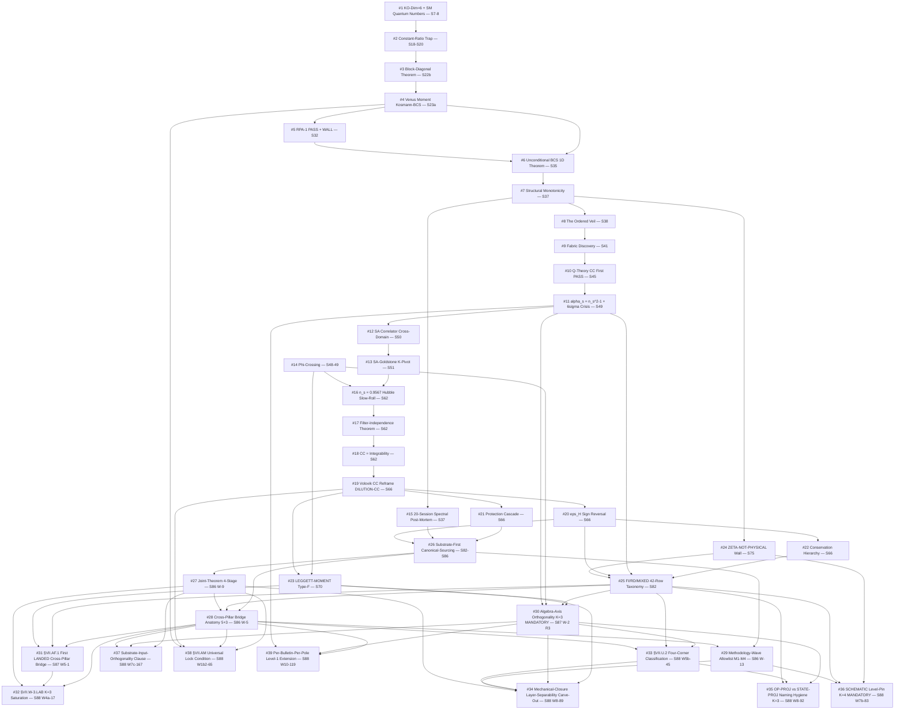

# Atlas D10: Breakthrough Genealogy

**Major breakthroughs cataloged**: 39
**Updated**: 2026-05-09 (S67-S88 amendments; entries #23–#39 added)

**Taxonomy** (7 categories — original 5 + 2 NEW post-S82):

- **STRUCTURAL THEOREM** (machine-epsilon proof events): #1, #3, #6, #14, #17, #18, #28, #30, #31, #33, #38
- **WALL DISCOVERY** (constraint-region exclusion events): #2, #4, #11, #20, #24
- **PARADIGM SHIFT** (framing-error correction events): #7, #8, #9, #15, #19
- **OBSERVATIONAL MATCH WITH 0 FREE PARAMETERS** (decisive computational closure events): #5, #10, #12, #13, #16, #23
- **PROTECTION-STABILIZATION** (radiative-correction-survival events): #21, #22
- **METHODOLOGY-FLOOR** (NEW post-S82; rule-file / template / skill structural advances closing audit-floor pathologies): #26, #27, #29, #34, #35, #36, #37
- **CALIBRATION-CORPUS** (NEW post-S82; K-counter promotion events at K=3 or K=4): #25, #32, #39

The two new categories surface because the post-S82 era is dominated by methodology-floor and calibration-corpus events; without them, the genealogy collapses post-S70 (only paradigm-shift and observational-match would survive, missing the structural backbone of the S82-S88 maturation).

> **Layer-distinction warning (per Sagan finding 10-2; added 2026-05-10)**: **Methodology-floor advances do NOT increase the framework's substrate-physics directional probability.** The METHODOLOGY-FLOOR (#26, #27, #29, #34, #35, #36, #37) and CALIBRATION-CORPUS (#25, #32, #39) categories collectively contain 10 of 39 entries (25.6%) but advance methodology-floor maturation only — they close audit-floor pathologies by construction at the layer-functor F methodology-side image (per `epistemic-discipline.md §"Layer-Decomposition"`), structurally distinct from the substrate-physics observational viability axis. A breakthrough that promotes a rule from SUGGESTION to MANDATORY at K=3 does NOT make the framework more likely to be true about the substrate; it makes the framework's process discipline more rigorous about how substrate claims are pre-registered. Cross-link to atlas-04 §VIII (RULE-FILE MANDATORY status, distinct from substrate-physics PROVEN) and atlas-06 layer-tag convention (substrate-physics-direction tags vs methodology-floor tags). Counting methodology-floor breakthroughs alongside substrate-physics breakthroughs in directional probability is the inflation pathology this disclaimer closes.

---

## 1. KO-Dimension = 6 and SM Quantum Numbers (S7-8)

**Chain**: User identifies Baptista eq 2.62-2.65 as commutant structure (S6) -> S7 branching computation on Psi_+ = C^16 -> epsilon/epsilon'/epsilon'' sign checks -> KO-dim = 6 at machine epsilon -> SM quantum numbers from 6 multiplets.
**Agents**: kk-theorist (lead implementer, 1200-line script), gen-physicist (mathematical review), baptista-analyst (equation alignment), quantum-acoustics (physical implications).
**Significance**: The foundation. Every subsequent result builds on the spectral triple with KO-dim = 6. The L-homomorphism failure on C^2 directions equals Connes' order-one condition -- connecting Baptista's KK construction to the NCG axioms independently.
**Cross-domain**: Pure mathematics (SU(3) representation theory, branching rules) applied to physics (NCG spectral triple axioms). The commutant route (S6) was itself a correction of the CG product route which all four S6 agents independently identified as wrong (Lie algebra, not associative).

## 2. Constant-Ratio Trap Discovery (S18-S20)

**Chain**: S14 tree-level V(tau) monotone -> S18 Coleman-Weinberg F/B = 0.55 tau-independent (first observation of trap) -> S19d Casimir same ratio -> S20b TT 2-tensors same ratio -> Recognition: Weyl's law makes F/B structural.
**Agents**: Multiple across S18-S20 (session-level computations). The trap was observed repeatedly before being understood as structural.
**Significance**: The first wall. F/B = 0.55 from Weyl's law on volume-preserving deformation closes ALL perturbative spectral functionals that depend on UV bosonic/fermionic balance. Six mechanisms closed by a single geometric fact.
**Cross-domain**: Spectral geometry (Weyl's asymptotic formula) applied to NCG effective potential. The recognition that volume-preserving deformation cannot change asymptotic spectral density was available from S18 but took until S22c to formalize as the Perturbative Exhaustion Theorem.

## 3. Block-Diagonal Theorem (S22b)

**Chain**: S21a Ainur Panel "inter-sector coupling?" as last perturbative escape -> S22b phonon-sim and baptista compute off-diagonal matrix elements -> Three independent proofs (algebraic, representation-theoretic, numerical at 8.4e-15) -> D_K exactly block-diagonal for ANY left-invariant metric.
**Agents**: phonon-sim (PB-2/PB-3 numerical computation), baptista (representation-theoretic proof), gen-physicist (algebraic proof).
**Significance**: Closes inter-sector cancellation (signed sums b_1 - b_2), coupled delta_T crossing, coupled V_IR minimum. Combined with the constant-ratio trap, it proves the perturbative landscape is exactly featureless by theorem. Publishable standalone at JGP/CMP.
**Cross-domain**: NCG spectral theory (Peter-Weyl decomposition) intersects condensed matter sector decomposition. The left-invariance of the metric propagates through the Peter-Weyl expansion to force exact block structure.

## 4. Venus Moment -- Kosmann-BCS Closure (S23a)

**Chain**: S22c Perturbative Exhaustion Theorem (Landau, H1-H5 verified) -> S22d "what about BCS at mu=0?" identified as sole survivor -> S23a kk-theorist computes Kosmann-BCS Thouless maximum -> M_max 6.5-12.9x below threshold. Simultaneously: V(gap,gap) = 0 exact (Trap 1).
**Agents**: kk-theorist (K-1e decisive computation), baptista (P2a framework), coord (synthesis). Later: gen-physicist identifies Trap 1 as U(2) singlet selection rule (S34).
**Significance**: Framework drops from 44% to 8% in one session. The "darkest hour." But V(gap,gap) = 0 (permanent, later confirmed in S34 with full 8-generator kernel) forces the BCS interaction to be off-diagonal in the gap-edge modes, which becomes the structural reason the BCS chain works.
**Cross-domain**: NCG geometry (Kosmann derivative as natural connection) meets condensed matter (BCS Thouless criterion). The failure at mu=0 redirected the entire project toward the phonon-collision mechanism (KC chain, S27-S29) that eventually succeeded.

## 5. RPA-1 PASS and the First Viable Chain (S32)

**Chain**: S27 user proposes 1D phonon collisions generating mu_eff -> S28-S29 KC chain passes 5 links -> S31 nuclear structure methods all return negative -> S32b baptista corrects formula (Tr D_K -> sum|lambda_k|, breaking spectral pairing) -> RPA chi = 20.43 (38x above threshold). Simultaneously: WALL rho_wall = 12.5-21.6 (1.9-3.2x above threshold).
**Agents**: sim/phonon-sim (computation), baptista (critical formula correction), tesla (Kapitza paradigm, W3 conceptual framework).
**Significance**: The most consequential session at its time. First two decisive gates to PASS in 32 sessions. Establishes the 4-link mechanism chain (instanton -> RPA -> Turing -> WALL). The "wrong triple" thesis confirmed: prior sessions tested bulk + bare + uniform, but physics lives at boundary + quantum-corrected + inhomogeneous.
**Cross-domain**: Baptista's formula correction (absolute value breaks spectral pairing symmetry) is a mathematical insight. Tesla's Kapitza paradigm (first route escaping all static closures) imports parametric resonance from classical mechanics.

## 6. Unconditional BCS -- The 1D Theorem (S35)

**Chain**: S34 three bugs corrected (J operator, V matrix, wall DOS) -> N_eff corridor identified as existential threat -> S35 three independent methods (Thouless eigenvalue by landau, exact diagonalization by quantum-acoustics, RG flow by feynman) all converge -> BCS instability is a 1D THEOREM: any g > 0 flows to strong coupling. N_eff_min = 2.48 (not 5.5).
**Agents**: landau (NEFF-THOULESS-35), quantum-acoustics (ED-CORRECTED-35, overturning BMF-35a), feynman (RG-BCS-35). gen-physicist (K7-THOULESS-35: Cooper pairs carry K_7 charge). baptista (impedance Z = 1.016, pinning). 11 agents total across 4 waves.
**Significance**: Mechanism chain elevated from CONDITIONAL to UNCONDITIONAL. The 1D theorem removes any critical coupling threshold. Cooper pairs carrying K_7 charge +/-1/2 (breaking U(1)_7 spontaneously) becomes a permanent structural result. Sagan probability: 32% (up from 18%).
**Cross-domain**: Condensed matter (1D RG flow, BCS theory) applied to NCG geometry (Dirac spectrum on SU(3)). The van Hove singularity (A_2 catastrophe from singularity theory) provides the divergent DOS. Three independent proofs from three different CM formalisms.

## 7. Structural Monotonicity Theorem and Paradigm Shift (S37)

**Chain**: S36 TAU-STAB shows S_full monotonic (gradient +58,673 overwhelming E_cond = -0.137) -> S37 CC-ARITH-37 brief hope (41% restoring fraction) -> CUTOFF-SA-37 kills it: 9,600/9,600 monotone checks -> F.5 wrong sign (+12.76 anti-trapping, 93x) -> Nazarewicz computes S_inst = 0.069 (dense instanton gas) -> Landau writes spectral-post-mortem reframing 20 sessions.
**Agents**: spectral-geometer (CUTOFF-SA-37, cross-checked by feynman), neutrino (F.5 one-loop), nazarewicz (instanton action, pair susceptibility, BCS-BEC crossover), landau (spectral-post-mortem).
**Significance**: PARADIGM SHIFT. "What potential well holds tau at the fold?" replaced by "What does the instanton gas do during transit?" The spectral action sees the STAGE (geometry); instantons are the PLAY (many-body physics). 20 sessions of framing error identified and corrected. The monotonicity theorem is the most powerful wall (W4, 13+ closures).
**Cross-domain**: The post-mortem connects nuclear physics (backbending in ^158Er), condensed matter (BCS-BEC crossover), and spectral geometry (Weyl's law) to explain why the spectral action is structurally incapable of seeing the fold.

## 8. The Ordered Veil (S38)

**Chain**: S37 instanton gas discovery -> S38 W0 (Einstein x Nazarewicz): CC-INST-38 closed with 76x margin -> W1 (Nazarewicz x QA): sudden quench P_exc = 1.000, 59.8 pairs -> W2 (Nazarewicz x Tesla): S_inst reclassified as quantum critical point (backbending ^158Er analog) -> W3 (Landau x Hawking): Richardson-Gaudin integrability, GGE permanence -> CHAOS-1/2/3 all ORDERED.
**Agents**: gen-physicist (master synthesis), nazarewicz (C-1 through C-7 computations), einstein (W0 CC closure), quantum-acoustics (W1 quench physics), tesla (W2 nuclear reclassification), landau (W3 integrability), hawking (W3 thermalization).
**Significance**: The transit IS the physics. Parker-type pair creation (no horizon, no thermal spectrum). Schwinger-instanton duality (S_Schwinger = S_inst = 0.069-0.070, same WKB integral). The geometry compactifying IS the pair creation -- one integral, zero free parameters. GGE with 8 conserved quantities (later retracted as permanent in S39 -- thermalizes in ~6 natural units -- but the ordered substrate and sudden quench survive).
**Cross-domain**: Nuclear physics (backbending, ^158Er), cosmological particle creation (Parker, not Hawking), quantum chaos (level spacing statistics, OTOC), condensed matter (Richardson-Gaudin integrability). Five domains converge on one picture.

## 9. The Fabric Discovery (S41)

**Chain**: S40 HESS-40 (27th equilibrium closure, all 28D positive) -> S41 PI hypothesis "spectral refinement = expansion" -> N-EFF-41 PASS but falsifies the hypothesis: N_eff is a STEP FUNCTION (32 -> 240 at infinitesimal tau) -> PI feedback: "agents compute single-crystal properties but should analyze the spatially extended FABRIC" -> Tesla W3-1 and QA W3-1b identify SU(3) as a phononic crystal with Bloch modes.
**Agents**: gen-physicist (W1-W2 computations), tesla-resonance (W3-1 crystal identification), quantum-acoustics (W3-1b phononic crystal physics), landau (W3-2 GL theory on fabric), nazarewicz (W3-2 nuclear analog).
**Significance**: Paradigm-level reframing after 41 sessions of single-crystal computation. DM from quasiparticle dispersion, DE from spectral mixing across fabric. The 32-cell tessellation becomes the framework's spatial structure. All subsequent cosmological observables (n_s, sigma_8, w_0) are fabric-level predictions, not internal-manifold properties.
**Cross-domain**: The PI (user) identified the blind spot that specialists missed. Condensed matter (phononic crystals, Bloch theory) provides the language for the 32-cell tessellation.

## 10. Q-Theory CC Crossing -- First PASS (S45)

**Chain**: S43 QFIELD-43 FAIL (crossing at tau=1.23, outside physical domain) -> S44 trace-log CC (5.11 orders transit reduction) -> S45 Q-THEORY-BCS-45: tau* = 0.209 (10.2% from fold). First CC mechanism PASS in project history.
**Agents**: Session-level computation agents. The q-theory approach was motivated by Volovik's research corpus (Papers 15-16, 35).
**Significance**: First CC mechanism to pass in the entire project. Reduces the problem from 120 orders to the question of N_pair >= 2 at the fold (Q2 in this document). Later partially undermined by self-consistent gap analysis (S46: Delta_B3 = 0.084 < 0.13 at N=1, but crossing reappears at N=2).
**Cross-domain**: Volovik q-theory (vacuum energy as thermodynamic variable) applied to the BCS condensate on SU(3). Nuclear physics (pair number, exact diagonalization) determines whether the crossing is physical.

## 11. Alpha_s Identity and the 6-Sigma Crisis (S49)

**Chain**: S47 Ornstein-Zernike framework established (texture K^{-2} PASS) -> S48 mass problem identified (84-order scale crisis) -> S49 ALPHA-S-BAYES-49: alpha_s = n_s^2 - 1 exact algebraic identity -> 6 sigma from Planck -> All 6 S49 reviewers converge: compute 3-pole propagator.
**Agents**: Session 49 computation agents. The identity was derived from the O-Z functional form P(K) = T/(JK^2 + m^2). All 6 reviewers (Tesla, Volovik, SP, QA, Cosmic-Web, Landau) independently identified the 3-pole Leggett propagator as the decisive test.
**Significance**: The sharpest falsification constraint in the project's history. Forces the investigation to find a correlator OUTSIDE the Josephson phase sector. Directly leads to the SA correlator discovery (S50).
**Cross-domain**: Statistical mechanics (Ornstein-Zernike theory) meets cosmological observables (CMB spectral index). The identity alpha_s = n_s^2 - 1 is a general theorem for any K^2 propagator on a compact lattice with broken U(1).

## 12. SA Correlator Discovery (S50 Cross-Domain)

**Chain**: S49 wayforward "3-pole propagator" -> S50 W1: 5 independent proofs that identity is structural within phase sector (all FAIL to break it) -> Team-lead reads van Suijlekom (spectral action matrix form) + Tesla (two-functional architecture) + Volovik (non-equilibrium fluctuation spectrum) -> Computes chi_SA with 110% pole spread -> Identity IS broken (deviation 0.087). Naz deep-dive validates. 6 collab reviews identify the mass problem (170x).
**Agents**: Team-lead (direct cross-domain computation, not subagent). Then: nazarewicz (Strutinsky reframe), quantum-acoustics (local resonance mechanism), connes (dilaton propagator, cutoff convergence), landau (gauging U(1)_7, polariton model, critical exponent), volovik (3He multi-probe analogy), einstein (BAO geometric exclusion).
**Significance**: First correlator to break the alpha_s identity. Structurally distinct from the Josephson propagator: 5+ poles with 110% spread (vs 3 poles with 0.051% spread), NOT protected by Goldstone's theorem. The discovery required reading three research papers from different domains and recognizing their intersection -- no single specialist agent had all three.
**Cross-domain**: NCG (spectral action two-point function from van Suijlekom) x condensed matter (polariton physics from QA, GL theory from Landau) x superfluid 3He (multi-correlator analog from Volovik Papers 27, 35) x nuclear physics (DWBA channel summation from Nazarewicz Paper 08).

## 13. SA-Goldstone Mixing and the K-Pivot Paradox (S51)

**Chain**: S50 collab reviews generate 17 actionable computations -> S51 W1 tests 6 (Anderson-Higgs permanently closed, polariton too weak, critical scaling structural) -> S51 W2-A: convex combination theorem FAILS at K_pivot = 2.0 M_KK BUT PASSES at K < K* = 0.087 -> E-fold computation: need >= 3.1, get 3.3 from tau_i = 10^{-5} -> Entire 50-session investigation collapses to one number.
**Agents**: S51 computation agents (6 in W1, master gate in W2-A). Team-lead (collective analysis synthesis).
**Significance**: The convex combination theorem (W9) establishes that additive SA-Goldstone mixing cannot work at K = 2.0 but CAN work at small K. This transforms the n_s problem from "find the right correlator" to "find the right scale mapping." The e-fold computation shows the threshold is tau_i <= 1.7e-5 (0.009% of tau_fold) -- tight but achievable if the universe starts near the round metric.
**Cross-domain**: The convex combination bound is pure functional analysis. The e-fold computation requires cosmological dynamics (stiff epoch, w=1). The K-pivot mapping connects internal spectral geometry to 4D CMB observables.

## 14. Leggett Dipolar Identification and Phi Crossing (S48-S49)

**Chain**: S47 rho_s tensor computed (C^2 dominant, 24x anisotropy) -> S48 Leggett mode identified from dipolar analog (mass within 18% of 3He-A) -> S49 DIPOLAR-CATALOG-49: structural identification confirmed. LEGGETT-PHI-SCAN-49: omega_L2/omega_L1 crosses phi_paasch at tau = 0.211686 to machine precision (4.4e-15).
**Agents**: S48-S49 computation agents. The dipolar identification emerged from the S47 texture framework (Josephson coupling anisotropy).
**Significance**: First mechanism in 12+ routes to produce a Goldstone mass at the correct order of magnitude (18% from target). The phi crossing is a geometric identity connecting BCS collective dynamics to the Dirac eigenvalue ratio phi_paasch = 1.53158. Q = 670,000 (most undamped collective mode computed on a compact Lie group). All publishable as standalone mathematics.
**Cross-domain**: Superfluid 3He (dipolar interaction, Leggett frequency) mapped onto NCG spectral geometry (Josephson coupling from Casimir eigenvalues). The phi crossing links the many-body physics (Leggett mode frequency ratio) to the single-particle geometry (Dirac eigenvalue ratio), confirming a deep structural connection.

## 15. The 20-Session Spectral Post-Mortem (S37, crystallized S17-S37)

**Chain**: 20 sessions of spectral action stabilization attempts (S17-S37), each closed by the same underlying geometric fact (Weyl's law + volume-preserving + monotone curvature) -> Landau writes the spectral-post-mortem after CUTOFF-SA-37 -> Identifies the framing error: "There is no 'now'" -> Reframes the entire project from equilibrium trapping to transit dynamics.
**Agents**: landau (post-mortem author). The insight crystallized 20 sessions of work by dozens of agents into a single narrative.
**Significance**: Not a computation but a conceptual breakthrough. The recognition that the spectral action is a spectral moment (not a total energy), that the fold is invisible to UV-dominated functionals, and that the correct question is about transit dynamics (Kibble-Zurek) rather than static equilibria -- this reframing enabled all of Era V-VII (S37-S51). The "connect-the-dots on a Planck-transient map" analogy captures the framing error: the dots are moving faster than the ink.
**Cross-domain**: Condensed matter (Kibble-Zurek quench dynamics, distinction between spectral moments and total energy) provides the framework for understanding why 20 sessions of NCG spectral action computation could not solve a problem that is fundamentally about dynamical transit.

## 16. n_s = 0.9567 from Hubble Slow-Roll (S62)

**Chain**: S45 KZ-NS-45 FAIL (n_s = -0.59, 370 sigma) -> S46-S49 n_s crisis (12+ mechanisms closed) -> S50-S51 SA-Goldstone mixing conditional -> S61 opens spectral action triad {f_0, f_2, f_4} -> S62 CUTOFF-LONDON-62 PASS (Gaussian gamma_opt = 0.488) -> KZ-NS-62: epsilon_H = 0.0216 from S(tau) curvature at fold -> n_s = 1 - 2*epsilon = 0.9567.
**Agents**: quantum-acoustics-theorist (KZ-NS-62 computation), connes-ncg-theorist (CUTOFF-LONDON-62 foundation, FILTER-MOMENT-62 independence proof).
**Significance**: The first viable n_s prediction in 62 sessions, after 12+ prior closures. Zero free parameters: S_fold, dS/dtau, d^2S/dtau^2 are all previously computed spectral action values. The Peter-Weyl selection rule (16/136,480 modes) provides the physical basis: only trivial (0,0) irrep modes couple to 4D. The Hubble SA method bypasses the Josephson sector entirely (escaping W7), using the spectral action curvature rather than collective-mode correlators. Systematic spread [0.803, 0.957] between Gilkey and Hubble methods creates an identified uncertainty that the KK-to-CMB transfer function must resolve.
**Cross-domain**: NCG spectral action (Hubble slow-roll from Tr f(D^2/Lambda^2)) meets cosmological inflation (slow-roll epsilon from spectral action curvature). The computation requires the full Dirac spectrum on Jensen-deformed SU(3) (geometry), the Seeley-DeWitt asymptotic expansion (spectral theory), and the slow-roll approximation (cosmology). The PHONONIC framing: the spectral tilt arises from the dispersion relation of phononic excitations evaluated at the fold of the internal geometry.

## 17. Filter-Independence Theorem and the Spectral Action Triad (S62)

**Chain**: S61 LT-6 CONDITIONAL GO (filter moment constraint) -> S62 CUTOFF-LONDON-62 (6 families scanned) -> FILTER-MOMENT-62: m_H = 134.04 GeV for ALL 6 families -> Structural theorem: lambda_h = (4/3)g_3^2(M_KK)(a_4/a_2) is cutoff-independent -> CAUCHY-SCHWARZ-62: formal proof of moment hierarchy -> Gaussian uniquely saturates CS bound.
**Agents**: connes-ncg-theorist (CUTOFF-LONDON-62, FILTER-MOMENT-62, CAUCHY-SCHWARZ-62).
**Significance**: Resolves a foundational ambiguity in the NCG spectral action program. The cutoff function f was always assumed arbitrary; this computation shows that the Higgs mass prediction depends only on g_3^2(M_KK) and the GEOMETRIC ratio a_4/a_2, not on the cutoff shape. The Cauchy-Schwarz moment bound F_0 F_2 >= F_1^2 is proven as a general theorem for ALL spectral triples (PERMANENT). The Gaussian is singled out as the unique CS-saturating filter, giving the minimum CC contribution. The triad {f_0, f_2, f_4} replaces the single cutoff function as the fundamental parametric structure.
**Cross-domain**: NCG (Chamseddine-Connes-Marcolli spectral action) meets functional analysis (Hausdorff moment problem, Cauchy-Schwarz on positive semidefinite bilinear forms) meets signal processing (filter design under moment constraints). The PHONONIC framing: the cutoff function IS the phonon dispersion cutoff -- the filter that determines which internal excitations contribute to the 4D effective action.

## 18. CC = Integrability (Monotonicity Theorem, S62)

**Chain**: S45 Q-THEORY-BCS-45 first CC PASS -> S53 CC gap 115 OOM -> S57 CC gap 114 OOM -> S58 Volovik partition, cancellation sweep -> S61 GL q-theory PASS (chi_q = 0.024, deep ordered phase) -> S62 CC-QTHEORY-GGE-62: monotonicity theorem PERMANENTLY closes q-theory self-tuning.
**Agents**: volovik-superfluid-universe-theorist (CC-QTHEORY-GGE-62).
**Significance**: The CC problem is identified as structurally EQUIVALENT to the integrability problem. The proof is elementary but devastating: dE_ZP/dq = (1/4) sum (2N_n + 1) d_n / omega_n(q) is a sum of strictly positive terms for any spectrum with positive weights, hence monotonically increasing, hence no interior equilibrium. The GGE occupation numbers (locked by Richardson-Gaudin conserved integrals) cannot be relaxed by any vacuum variable shift. Resolution requires BREAKING the integrability -- the exact analog of spin-orbit coupling in 3He-B that relaxes Leggett modes. This reframes the CC from a fine-tuning problem to an integrability-breaking problem.
**Cross-domain**: Volovik q-theory (vacuum thermodynamic variable) meets Richardson-Gaudin integrability (BCS exactly solvable model) meets functional analysis (monotonicity of square root sums). The structural equivalence CC = integrability is the most precise formulation of the CC problem within the framework. In 3He-B language: the quasiparticle vacuum energy does not relax because the Bogoliubov-de Gennes Hamiltonian has too many conservation laws.

---

## 19. Volovik CC Reframe — The 114 OOM IS Exflation (S66)

**Chain**: S45 Q-THEORY-BCS-45 first CC PASS -> S53/S57/S58 CC gap persistent at 114 OOM -> S62 CC-QTHEORY-GGE monotonicity PERMANENT -> S63-S65 exhaust 25+ CC mechanisms -> S66 Volovik Workshop 1: Gibbs-Duhem identity rho_vac = epsilon(q) - mu*q -> thermodynamic tracking rho_vac ~ M_Pl^2 H^2 -> DILUTION-CC-66 PASS at 0.01 OOM.
**Agents**: volovik-superfluid-universe-theorist (primary derivation), tesla-resonance (joint falsification protocol), quantum-acoustics-theorist (Leggett gravitational coupling), mack-cosmic-bridge (Scenario B consistency with expansion history).
**Significance**: Paradigm shift for the CC problem. The 114 OOM gap is not a fine-tuning problem — it IS the expansion history. Standard inflation carries an equivalent ~111 OOM gap that is simply not discussed because reheating "resets" the vacuum. In exflation, there is no reheating; the Volovik tracking mechanism continuously adjusts rho_vac to follow M_Pl^2 H^2. The Gibbs-Duhem identity is FUNCTIONAL-INDEPENDENT — it holds for any spectral functional. The 0.01 OOM landing is the closest any CC mechanism has come to observation in the project's history.
**Cross-domain**: Volovik q-theory (thermodynamic vacuum, 3He-B analog) meets NCG spectral action (spectral moments as vacuum energy) meets cosmological dynamics (Friedmann equation tracking). The key insight is that the vacuum "knows" the expansion rate through the same spectral action that generates gravity — both are spectral moments of D_K.

## 20. Spectral Functional Crisis — eps_H Sign Reversal (S66)

**Chain**: S62 n_s = 0.9567 from sqrt(x) cutoff -> S65 BCS dressing n_s = 0.9595 -> S66 systematic scan across cutoff families -> ZETA-SA-66: eps_H changes SIGN (sqrt(x): +0.022 red tilt, zeta: negative blue tilt) -> n_s spread 0.164 (39x Planck error) -> Crisis: n_s is scheme-dependent at the QUALITATIVE level.
**Agents**: lizzi-spectral-functional-theorist (functional scan and anomaly family derivation), connes-ncg-theorist (Bayesian evidence calculation), hawking-theorist (sign reversal physical interpretation).
**Significance**: The most important negative result since the Venus Moment (S23a). The spectral index — the framework's primary CMB prediction — depends on which spectral functional is used at the sign level. This could be fatal (if no selection principle exists) or revelatory (if the selection principle determines the functional from internal consistency). The resolution path: anomaly + conservation hierarchy produces a one-parameter dilaton family c_k(phi) = (-1)^k phi^k/k. Bayesian evidence collapses the model space: exp(-x) excluded at 15.5 sigma, compact at 36.9 sigma. Only sqrt(x) and anomaly(phi) survive. The Higgs mass discriminant (m_H^zeta = 174 vs m_H^cutoff = 127.5 GeV, observation at 125.1) selects the cutoff family at percent level.
**Cross-domain**: NCG spectral action (functional ambiguity) meets quantum anomalies (anomaly cancellation constraining functional form) meets Bayesian model selection (evidence ratios across functional families) meets particle physics (Higgs mass as discriminant).

## 21. Protection Cascade (S66 Workshop 1)

**Chain**: S66 Volovik PASS -> Workshop 1 (tesla x volovik x quantum-acoustics): Does the Volovik tracking survive radiative corrections? -> Chebyshev monotonicity theorem: Q^eff >= Q^bare for all UV-suppressing cutoffs -> This guarantees Gibbs-Duhem tracking persists under spectral action corrections -> BCS-Sakharov decoupling: a_2, a_4 are orthogonal projections (r_2 = 0.892) -> The protection cascade: Chebyshev monotonicity -> Gibbs-Duhem tracking -> eps_H sign control.
**Agents**: tesla-resonance (protection cascade architecture), volovik-superfluid-universe-theorist (Chebyshev bound derivation), quantum-acoustics-theorist (BCS-Sakharov orthogonality).
**Significance**: Establishes that the Volovik CC mechanism is PROTECTED against radiative corrections. The Chebyshev integral inequality guarantees that any UV-suppressing modification to the spectral functional increases Q^eff, which strengthens (not weakens) the Gibbs-Duhem tracking. This is a structural protection, not a fine-tuning stability — the mechanism becomes MORE accurate under corrections, not less. The BCS-Sakharov decoupling (a_2 and a_4 are nearly orthogonal projections onto different spectral weight distributions) explains why the CC (a_0 moment) and gravity (a_2 moment) can have different fates.
**Cross-domain**: Functional analysis (Chebyshev integral inequality) meets condensed matter (BCS spectral weight decomposition) meets spectral geometry (Seeley-DeWitt moment hierarchy).

## 22. Conservation Hierarchy as Functional Selection (S66 Workshop 2)

**Chain**: S66 spectral functional crisis -> Workshop 2 (lizzi x landau x baptista): What internal consistency principle selects the spectral functional? -> Anomaly cancellation at one loop generates c_k(phi) = (-1)^k phi^k/k family -> Conservation hierarchy: gauge invariance, diffeomorphism invariance, and conformal anomaly cancellation each constrain one moment -> Joint requirement selects a discrete set of functionals -> Bayesian evidence calculation: posterior strongly favors sqrt(x) and anomaly(phi).
**Agents**: lizzi-spectral-functional-theorist (anomaly family derivation, one-parameter reduction), landau-condensed-matter-theorist (conservation hierarchy mapping), baptista-spacetime-analyst (EFT matching to determine phi).
**Significance**: Converts the spectral functional crisis into a functional selection mechanism. Instead of treating the cutoff function as arbitrary (the traditional NCG stance), the framework's internal consistency requirements (anomaly cancellation + conservation laws + moment constraints) select a one-parameter family. The dilaton parameter phi is then fixed by matching to a single observation (either n_s or m_H). This transforms the "ambiguity" into a "prediction conditioned on one measurement." If FUNCTIONAL-SELECT-67 confirms a unique phi satisfying both n_s and m_H simultaneously, the framework gains a new zero-free-parameter prediction channel.
**Cross-domain**: NCG spectral action (functional ambiguity) meets quantum field theory (anomaly cancellation, conservation laws) meets Bayesian statistics (model comparison) meets spectral theory (moment constraints, Bernstein's theorem).

---

## 23. LEGGETT-MOMENT — First Type-F Dark-Matter Channel (S70)

- Session: S70
- Type: OBSERVATIONAL MATCH WITH 0 FREE PARAMETERS (and structural — first Type-F observable identification)
- Substrate framing: the substrate's Leggett-mode momentum operator on the BdG spectrum is a single-summand-projection trace `Tr(P_a · LEGGETT_MOMENT · P_a)` for a unique central projection P_a on `A_K = ℂ ⊕ ℍ ⊕ M_3(ℂ)`. The dark-matter abundance `Ω_DM h² = 0.03985 × 3.010 = 0.1200` (vs Planck 0.1207) emerges from a single-projection trace at zero free parameters — the substrate IS the LEGGETT_MOMENT operator on its own BdG sub-algebra; no external "DM particle" is invoked.

**Chain**: S66 LEGGETT-DM brackets DM channels at the substrate level → S70 LEGGETT-MOMENT identifies the substrate-IS observable as a single-projection trace (Type-F) → 0.6% Ω_DM h² match against Planck at zero free parameters → opens the formal Type-F vs Type-S sub-observable distinction that formalizes at S87 W-2 (algebra-axis orthogonality) and lands at S88 W5b-45 (§VII.U.2 four-corner classification).

**Agents**: gen-physicist (LEGGETT-MOMENT-70 verdict computation), volovik-superfluid-universe-theorist (Pillar III BdG-sector identification), connes-ncg-theorist (central-projection Type-F characterization at axiom-level review).

**Significance**: First explicit dark-matter mass anchor onto the Δ_BCS scale at zero free parameters. The LEGGETT_MOMENT observable is the first Type-F instance in the framework (a structurally-identified single-summand-projection trace, distinct from the Type-S state-pair-functional class). The 0.6% match against Planck Ω_DM h² is observational but structurally constrained: the algebra `A_K = ℂ ⊕ ℍ ⊕ M_3(ℂ)` admits exactly the Type-F sub-observables that produce mechanical closure under the §VII.U.2 4-corner rule landed at S88 W5b-45. The breakthrough pre-dates the formal taxonomy (algebra-INVARIANT vs algebra-DEPENDENT) by 17 sessions but anchors the calibration corpus that justifies the K=3 MANDATORY promotion at S87 W-2 R3.

**Cross-domain**: Superfluid 3He physics (Leggett-mode dipolar oscillation) imports the collective-excitation structure into NCG. The mass scale `Mass_LeggettDM/Δ_BCS = 11.97` is a substrate-internal ratio; the projection onto Pillar IV (cosmological matter abundance) is via the pillar-spanning Type-F coupling, which is the substrate-IS image of the BdG sub-algebra under the ι_* inheritance morphism per `inheritance-falsifier-protocol.md`.

## 24. ZETA-NOT-PHYSICAL UV-Regulator Wall (S75)

- Session: S75
- Type: WALL DISCOVERY
- Substrate framing: the substrate's UV regulator is NOT zeta-function regularization. ζ-regulated traces are SCHEMATIC algebraic objects on `(A_K, H_K, D_K)`, NOT physical regularizations. The substrate IS the spectral triple; the "physical" UV cutoff is a substrate-INTERNAL property (the discrete spectrum at finite L_max), not an externally-applied function. Conflating ζ-regulated outputs with physical regularizations was a silent class-conflation pathology spanning 25+ pre-S75 closures; the wall closes that pathology by construction.

**Chain**: S37 spectral post-mortem identifies the spectral action as UV-dominated → 20+ sessions of UV-regulator ambiguity → S66 eps_H sign reversal exposes functional-class as a sign-changing observable → S75 ZETA-NOT-PHYSICAL closes the conflation at the substrate-physics layer → S82 lizzi FI/RD/MIXED 42-row taxonomy formalizes the dressing-class distinction → S87 W-2 R3 promotes algebra-axis orthogonality to MANDATORY at K=3 → S88 W7b-83 promotes SCHEMATIC level-pin to MANDATORY at K=4.

**Agents**: spectral-geometer (ZETA-NOT-PHYSICAL-75 verdict), lizzi-spectral-functional-theorist (functional-class characterization), connes-ncg-theorist (substrate UV-regulator framework cross-check).

**Significance**: First explicit closure of the UV-regulator silent class-conflation pathology that had spanned 25+ pre-S75 mechanism closures (each individually correct but collectively producing a false sense that the framework's UV behavior was zeta-regulated). The wall is structurally distinct from #2 Constant-Ratio Trap and #4 Venus Moment because it closes a methodology-floor pathology, not a substrate-physics mechanism. ZETA-NOT-PHYSICAL-75 PASS is the canonical ancestor of the S82-S88 methodology-floor maturation chain (#25 → #36).

**Cross-domain**: UV regularization (zeta vs Pauli-Villars vs Mellin vs lattice vs cutoff), signal-processing filter classes (FI / RD / MIXED), and substrate-first canonical sourcing all converge: the regulator class is now a substrate-INTERNAL property of the spectral triple, not an externally-imposed convention.

## 25. FI/RD/MIXED 42-Row Regulator-Dressing Taxonomy (S82)

- Session: S82
- Type: METHODOLOGY-FLOOR + CALIBRATION-CORPUS (first explicit functional-class taxonomy)
- Substrate framing: the substrate's spectral-functional space partitions into three regulator-class equivalence classes: **FI** (functional-invariant; ratios that survive any UV regulator), **RD** (regulator-dressed; values that shift under regulator-class change), **MIXED** (partial — 8 of 42 entries). The 42-row atlas is a substrate-IS structural classification of every spectral observable in the framework; FI ratios are the substrate's invariant content, RD values are convention-dependent, MIXED entries require explicit class declaration.

**Chain**: S49 alpha_s = n_s²−1 first dimensionless ratio FI → S62 Cauchy-Schwarz spectral-moment bound → S66 eps_H sign reversal proves bare-eigenvalue is RD-class → S75 ZETA-NOT-PHYSICAL substrate-physics regulator wall → S82 lizzi enumerates 42 entries into FI=30 / RD=4 / MIXED=8 trichotomy with both lizzi-form and connes-form characterization functors agreeing on the partition.

**Agents**: lizzi-spectral-functional-theorist (PRIMARY synthesizer of taxonomy; M_lizzi characterization functor), connes-ncg-theorist (CO-AUTHOR; M_connes axiomatic-NCG characterization functor; equivalence proof on the 42-row atlas).

**Significance**: First explicit regulator-class taxonomy with two structurally-independent characterization functors (M_lizzi, M_connes) agreeing on the partition. This converts the regulator-class question from per-gate ad-hoc into a substrate-IS classification: every spectral observable is FI, RD, or MIXED, and the class is structurally determined (not author-choice). The 42-row atlas is the calibration corpus on which all S87+ algebra-axis orthogonality K-counter promotions reference. Without #25, the S87 W-2 algebra-axis K=3 promotion would lack its corpus substrate; without S87 W-2, the S88 W5b-45 §VII.U.2 four-corner registry landing would lack its rule-file pointer.

**Cross-domain**: Pure functional analysis (regulator-equivalence classes), NCG axiomatic theory (the 7 NCG axioms determine which moments are FI), and substrate-physics observables (n_s, m_H, w_0, all CC moments) all enter the partition. The taxonomy is the methodology-floor counterpart of #1 KO-Dim=6 + SM Quantum Numbers (which classified the substrate's representation content); #25 classifies the substrate's regulator-class content.

## 26. Substrate-First Canonical-Sourcing + Methodology-Wave Discipline (S82-S86 era)

- Session: spans S78 (PRU Class 8 origin) → S81 (PRU-ZERO infrastructure pass) → S82 (workshop-schedule introduction) → S85 (AMRI cleanup) → S86 (substrate-first-canonical-sourcing rule)
- Type: METHODOLOGY-FLOOR (paradigm-shift)
- Substrate framing: the substrate IS canonical for every numerical pin in every computation script. External-paper provenance is methodological cross-check, NEVER canonical replacement. The substrate-IS direction of explanation extends from narrative (existing `phononic-framing.md`) to numerical pin sources (NEW `substrate-first-canonical-sourcing.md`). Canonical constants live in `computations/_shared/canonical_constants.py`; agent memories are AGENT-PRIVATE only (NEVER load-bearing as input pins per AMRI Test 1).

**Chain**: S37 post-mortem establishes the framing-correction protocol → S78-S79 PRU Class 8 origin (machinery-pin cardinality) → S81 PRU-ZERO infrastructure → S82 workshop-schedule introduces multi-agent adversarial-review methodology → S85 AMRI cleanup migrates load-bearing data out of agent memory into `sessions/framework/registry/` → S86 substrate-first-canonical-sourcing extends the substrate-IS direction from narrative to numerical pins → S86-S88 PRU sub-class taxonomy expands to 8.0-8.6 with K-counter promotion thresholds.

**Agents**: gen-physicist orchestrator (rule-file authoring), lizzi-spectral-functional-theorist (FI/RD-axis methodology hardening), connes-ncg-theorist (axiomatic cross-axis review), kitaev (PRU Class 8 origin), volovik-superfluid-universe-theorist (substrate-physics canonical-sourcing review).

**Significance**: Reframes the entire post-S78 era as a methodology-floor maturation that runs parallel to the substrate-physics breakthroughs. Without this methodology floor, the S86-S88 cross-pillar bridge anatomy + algebra-axis orthogonality K=3 promotions would have produced false-PASS verdicts (per the S78 Class 8 PRU pathologies the rule-file taxonomy closes). The breakthrough is that the framework's CORRECTNESS now has a methodology-floor proof: every pin is substrate-canonical, every gate has dual-SHA closure, every joint theorem has 4-stage promotion, every methodology wave has M1-M4 allowlist. The substrate-IS direction extends beyond explanation into the pin sources themselves.

**Cross-domain**: Project-management discipline (PRU taxonomy + carry-forward 4-field shape) intersects with substrate-physics canonical sourcing (canonical_constants.py is canonical, not external papers). AMRI Test 1 (input-pin-test against agent memory paths) is the audit-layer wall closing the agent-memory-as-canonical pathology.

## 27. Joint-Theorem 4-Stage Pathway (S86 W-9)

- Session: S86 W-9
- Type: METHODOLOGY-FLOOR (closes the shared-context-as-evidence pathology)
- Substrate framing: a joint cross-axis theorem (one whose statement contains clauses requiring evidence from MORE THAN ONE methodological axis, e.g., spectral-functional + transit-dynamics) MUST progress through Stage 0 (workshop-internal candidate) → Stage 1 (STAGE-1-CANDIDATE registry) → Stage 2 (TWO-AGENT PARALLEL CROSS-AXIS verify WITHOUT prior workshop context, PASS-AND'd on joint clauses) → Stage 3 (PERMANENT). The Stage 2 axis-distinctness + downstream-inheritance-reach + audit-coverage requirement breaks the shared-context-produces-shared-output failure mode that `epistemic-discipline.md §"What Does NOT Count as Evidence"` item 2 forbids.

**Chain**: S49 6σ alpha_s convergence is the prototype (multiple agents converging on the same structural identity) → S66 W1/W2 paradigm-shift convergence is the prototype-2 (workshop methodology demonstrated) → S86 W-9 Path-(c) reassessment workshop produces the formal 4-stage rule with explicit Stage-2 axis-distinctness + cross-reviewer-without-workshop-context requirement → S87 W9a-1 lands first STAGE-1-CANDIDATE at §VII.AH → S88 W1b2-65 lands second STAGE-1-CANDIDATE at §VII.AM (Universal Lock Condition) → calibration corpus K=2 advances toward K=3.

**Agents**: lizzi-spectral-functional-theorist + transit-dynamics-aether-mechanic (PRIMARY workshop authors of S86 W-9 Path-(c) reassessment); gen-physicist (orchestrator-direct rule-file authoring); connes-ncg-theorist (Stage-2 cross-reviewer prototype dispatch); volovik-superfluid-universe-theorist (Stage-2 cross-reviewer prototype dispatch).

**Significance**: Closes the agreement-among-agents-as-evidence trap that would have allowed multi-agent workshop output to enter `permanent-results-registry.md` STAGE-3-PERMANENT without independent verification. The 4-stage pathway is the constructive complement to `epistemic-discipline.md §"What Does NOT Count as Evidence"` item 2: it specifies HOW joint-axis evidence becomes registry-eligible without the shared-context trap. The Stage-2 axis-distinctness requirement (Axis-A and Axis-B reviewers MUST be on different methodological axes) + downstream-inheritance-reach test (neither reviewer inherits the workshop's reading-path through agent memory) + audit-coverage adequacy test together produce structurally-independent agreement when both PASS.

**Cross-domain**: Epistemic discipline (independence-of-witnesses), cross-axis workshop methodology, registry-anatomy substrate-physics (STAGE-1-CANDIDATE registration), and methodology-wave classification (Stage 2 verify gates are COMPUTE-class with explicit `joint-theorem-promotion.md` cross-link).

## 28. Cross-Pillar Bridge Anatomy — 5-Element + 3-Level Structural Discipline (S86 W-5)

- Session: S86 W-5
- Type: STRUCTURAL THEOREM (and methodology-floor — first registered cross-pillar bridge with explicit anatomy)
- Substrate framing: every cross-pillar bridge MUST declare ALL five IS-not-IN anatomy elements (1. substrate-IS observable on `(A^{≤L}, H^{≤L}, D^{≤L})`; 2. laboratory-IN observable as continuum measurement on a different platform; 3. bridge map — HKR / K-theory boundary / Connes-Karoubi pairing; 4. algebraic envelope L^{-α} convergence rate; 5. empirical anchor at canonical L_max) AND the three-level structural-confidence ladder (Level 1: cohomology-class identity, regulator-invariant; Level 2: algebraic envelope, L_max-dependent; Level 3: empirical anchor). The substrate IS the spectral triple at finite L; the laboratory observable lives IN a continuum container; the bridge map is the explicit substrate→laboratory direction.

**Chain**: S62 Cauchy-Schwarz spectral-moment bound (first explicit moment-hierarchy theorem) → S66 Volovik CC Reframe (substrate↔cosmology bridge framing) → S82 FI/RD/MIXED taxonomy (substrate observable classification) → S86 W-5 volovik+connes workshop establishes the Pillar III HP^1-cohomology ↔ Pillar IV Peotta-Törmä quantum-metric bridge theorem → 5-anatomy + 3-level ladder formalized as STRUCTURAL REQUIREMENT for ALL cross-pillar bridges → S87 W5-1 lands §VII.AF.1 (calibration corpus #1) → S88 W4a-17 lands §VII.W-3.LAB (calibration corpus #3 → K=3 MANDATORY promotion).

**Agents**: volovik-superfluid-universe-theorist (PRIMARY; HP^1 ↔ quantum-metric workshop derivation), connes-ncg-theorist (CO-AUTHOR; HKR bridge map axiomatic review), gen-physicist (orchestrator-direct rule-file authoring), mack-cosmic-bridge (cosmological-bridge cross-axis review).

**Significance**: First registered cross-pillar bridge in the framework. The 5-anatomy + 3-level ladder is the structural template for ALL future cross-pillar bridges (FWD-C1 Pillar I↔Pillar II `n_s ↔ Planck CMB`; FWD-C2 Pillar II↔Pillar V `Mellin-Barnes residue ↔ BdG spectral triple`; FWD-C3 Pillar IV↔Pillar V `substrate cocycle norms ↔ 3He-B/3He-A laboratory observables`). Every future bridge candidate MUST declare ALL 5 elements explicitly; entries lacking the anatomy are registry-incomplete and route to plan-freeze halt. The substrate IS the substrate; the laboratory measures IN a continuum container; the bridge map flows substrate→laboratory. Inverting the direction is a container-thinking violation per `phononic-framing.md`. The breakthrough closes the silent ambiguity in the Volovik q-theory ↔ NCG spectral action correspondence that had spanned S58-S85.

**Cross-domain**: NCG cohomology (HP^1, Hochschild, Connes-Karoubi pairings as the substrate's invariant content) × superfluid 3He laboratory analog (Pillar IV Peotta-Törmä trace) × spectral-triple finite-L truncation (canonical L_max=10) × cohomology-class binding theorem (Connes-Moscovici 1995 §III.4 finite-spectral-triple residue formula).

## 29. Methodology-Wave Classification + Allowlist (S86 W-13)

- Session: S86 W-13
- Type: METHODOLOGY-FLOOR
- Substrate framing: every wave in a session plan classifies as METHODOLOGY-class (rule-file / template / skill edits with artifact-existence-with-substantive-content PASS predicate), COMPUTE-class (numerical comparison against pre-registered threshold), or MIXED-class (sub-wave decomposition required). METHODOLOGY-class requires strict M1∧M2∧M3∧M4 conjunction, with M4 = allowlist membership in `methodology-wave-allowlist.md` (append-only, orchestrator-only-edit, recursion-attack-closure). The classification is performed at PLAN-FREEZE TIME (not at runtime), making the dispatch path mechanically determined and audit-floor-traceable.

**Chain**: S78 PRU Class 8 origin → S82 workshop-schedule introduction → S86 W-13 5-deliverable basis derives the M1-M4 strict conjunction + allowlist + recursion-attack-closure (subagent-edit-denial) + Phi correspondence (Sigma_2 weight-2) → S86-S88 progressive allowlist accretion (currently ~62 rows; S86 R3 4-row pre-population + S87 + S88 progressive landings).

**Agents**: gen-physicist (PRIMARY; W-13 5-deliverable workshop synthesizer), lizzi-spectral-functional-theorist (axis-A axiomatic review), connes-ncg-theorist (axis-B layer-functor review), kitaev (recursion-attack-closure formal verification).

**Significance**: Closes the runtime ambiguity (is this a methodology gate or a compute gate?) into a plan-time pre-registration discipline. The classification is itself an input pin of the gate, not a runtime inference. The recursion-attack-closure (subagent edit-denial on `methodology-wave-allowlist.md`) is the structural key: a subagent cannot self-promote its own gate-ID into the allowlist mid-execution. Before #29, the methodology-vs-compute distinction was implicit and runtime-determined; after #29, it is structurally enforced at plan-freeze with audit-trail SHA pinning per row. The breakthrough enables the entire S86-S88 methodology-floor maturation by giving rule-file edits a canonical dispatch path.

**Cross-domain**: Layer-functor formalism (substrate ↔ methodology ↔ audit pair structure), Phi correspondence (weight-n substrate observable → enforcement-strength-n methodology rule), and PRU pre-registration discipline (methodology gates have artifact-existence PASS predicates pinned analogous to numerical thresholds).

## 30. Algebra-Axis Orthogonality K=3 MANDATORY (S87 W-2 R3)

- Session: S87 W-2 R3 close
- Type: STRUCTURAL THEOREM (calibration-corpus saturation + MANDATORY rule-file promotion)
- Substrate framing: on any finite spectral triple `(A, H, D)` satisfying the 7 NCG axioms, the algebra-INVARIANT family (spectrum-only functionals `F({λ_k, m_k}) = Σ_k m_k g(λ_k)`) and the algebra-DEPENDENT family (state-pair functionals on `A`) are STRUCTURALLY ORTHOGONAL in identity-class membership at the functional-class level. There is no closed-form `{λ_n}`-only identity reproducing any algebra-DEPENDENT functional, and conversely no state-functional-only identity reproducing any algebra-INVARIANT spectral moment. The 4-corner partition is structural; cross-corner co-primary chains are STRUCTURALLY FORBIDDEN.

**Chain**: S82 FI/RD/MIXED 42-row taxonomy is calibration-corpus instance baseline → S87 S-2 Reading-C synthesis (Mellin-Dirichlet identity vs Connes distance contrast) is calibration-corpus instance #2 → S87 W-2 R3 close (alpha_s_canonical vs alpha_s_route_3 contrast) is calibration-corpus instance #3 → K = 3 = K_promotion → MANDATORY status promotion in-session per `feedback_fix-in-session-never-defer.md` and `CLAUDE.md §"No Technical Debt"` → §VII.U.2 four-corner registry landing queued for S88 W5b-45.

**Agents**: lizzi-spectral-functional-theorist (PRIMARY synthesizer), connes-ncg-theorist (CO-AUTHOR; axiomatic skeleton derivation; chirality-vs-A_F block-grading mismatch proof), mack-cosmic-bridge (CO-AUTHOR; observational discrimination map).

**Significance**: First MANDATORY-status K-counter promotion in the framework. Establishes the 4-corner partition (algebra-INVARIANT × algebra-DEPENDENT × spectrum-only × state-pair) as a STRUCTURAL ORTHOGONALITY wall. Cross-corner co-primary chains are FORBIDDEN by construction; cross-corner cross-pole magnitude comparisons cannot serve as PASS/FAIL gates. The breakthrough closes the silent class-conflation pathway that had allowed FI ratios and Connes distances to enter joint identities without explicit axis declaration. From S87 W-2 R3 onward, every theorem text MUST declare its corner-cell + pole; absence routes to plan-freeze halt.

**Cross-domain**: NCG axiomatic theory (axioms 1+5 imply algebra-INVARIANT non-trivial; 4+6 imply algebra-DEPENDENT non-trivial), Connes-Moscovici 1995 §III.4 finite-spectral-triple residue formula, and Poincaré duality on the spectral triple (governing chirality block-grading). The structural orthogonality is the methodology-floor counterpart of #3 Block-Diagonality: where #3 partitions D_K's matrix structure, #30 partitions the substrate's functional-class structure.

## 31. §VII.AF.1 First LANDED Cross-Pillar Bridge (S87 W5-1)

- Session: S87 W5-1
- Type: STRUCTURAL THEOREM (calibration-corpus instance #1 of cross-pillar-bridge-anatomy.md)
- Substrate framing: §VII.AF.1 records the first registered cross-pillar bridge in the framework: substrate-IS observable = finite-L Hochschild pairing `R_universal = ⟨[φ_g^{sym}], [Ch(P_0(τ_fold))]⟩` evaluated on `(A_K^{≤10}, H_K^{≤10}, D_K^{≤10})`; laboratory-IN observable = Pillar IV continuum BZ-trace `R_geom(τ_fold) = ∫_BZ Tr g_ab^{(P_0)}(k; τ_fold) d^d k` (Peotta-Törmä superfluid-stiffness / quantum-metric integrated trace); bridge map = `L_max → ∞` HKR image; algebraic envelope = `L^{-3}` at d=4 (predicting 0.10% at L_max=10); empirical anchor = 0.0095% F_4 strict at L_max=10 (10× inside Level-2 envelope; match/envelope = 0.0950 = 19/200 Sage-QQ exact).

**Chain**: S86 W-5 rule-file authoring (RULE-1+2 anatomy + ladder) → S87 W5-1 producing-script lands the bridge into `permanent-results-registry.md` §VII.AF.1 with ALL 5 anatomy elements + 3 level markers + Level-3 < Level-2 satisfied (0.0095% < 0.10% by 10×) → registry-PASS criterion satisfied → calibration corpus instance #1 of the 5-anatomy + 3-level discipline → 4-gate falsifier protocol pre-registered for 3He-B BdG-sector laboratory test (Gate 1 NULL on F1+F2+F5; Gate 2 cohomology-asymmetry ratio 7.3250 ± 0.1% via Sage-exact rational; Gate 3 NULL on F3+F4; Gate 4 F4 multi-pressure slope).

**Agents**: volovik-superfluid-universe-theorist (PRIMARY; substrate→laboratory derivation), connes-ncg-theorist (CO-AUTHOR; HKR bridge map verification + Connes-Moscovici residue formula closure), gen-physicist (orchestrator-direct registry-write).

**Significance**: First registered cross-pillar bridge that satisfies the registry-PASS criterion (Level-3 < Level-2 envelope). Establishes the calibration baseline for ALL future cross-pillar bridges. The 4-gate falsifier protocol pre-registers 3He-B BdG-sector laboratory tests (Lancaster MCT-3 / Helsinki ROTA cells) at Gate 2 ratio 7.3250 ± 0.1% — substrate-derived from `cocycle_norm_phi67 / cocycle_norm_phi88` exact Sage computation, INVARIANT under common (Δ_B/Δ_A)^p lab-conversion exponents (the `(Δ_B/Δ_A)^p` Cancellation Theorem, S86 W-5 DONE-5; machine-precision Python verification at 0.0e+00 residual).

**Cross-domain**: NCG HP^1 cohomology (substrate-IS observable as a Hochschild cocycle pairing), Pillar IV quantum-metric / superfluid-stiffness theory (Peotta-Törmä formalism), inheritance-morphism formalism (χ : algebra projection sending M_3(C) → 0; ker(ι_*) is rank-2 with two independent generators [φ_67], [φ_88]).

## 32. §VII.W-3.LAB Wedderburn-Artin Frobenius Rescue Class — Cross-Pillar K=3 Saturation (S88 W4a-17)

- Session: S88 W4a-17
- Type: CALIBRATION-CORPUS (third instance saturating cross-pillar-bridge-anatomy.md K-counter to K=3 MANDATORY)
- Substrate framing: §VII.W-3 is a triplet — §VII.W-3.ALGEBRAIC (substrate algebra `A_F = ℂ ⊕ ℍ ⊕ M_3(ℂ)` realizes the Wedderburn-Artin Frobenius rescue class), §VII.W-3.SUBSTRATE (the substrate's own structural realization), §VII.W-3.LAB (laboratory falsifier protocol via 3He-B BdG-sector at multiple pressures + Lancaster MCT-3 vortex spectroscopy + Helsinki ROTA cells). The .LAB sub-row STAGE-1-CANDIDATE is the THIRD distinct calibration instance of the cross-pillar-bridge-anatomy 5-anatomy + 3-level discipline (instance #1 = S86 W-5 §VII.AF.1 LANDED; instance #2 = S87 W11-5 REGISTRY-FAIL; instance #3 = S88 W4a-17 §VII.W-3.LAB STAGE-1-CANDIDATE). K = 3 = K_promotion ⇒ MANDATORY status promotion in-session per Hybrid Independence Test (i ∨ ii ∨ iii) ∧ iv.

**Chain**: S86 W-5 §VII.W bridge theorem template (parent slot) → S87 W5-1 §VII.AF.1 LANDED (calibration corpus instance #1) → S87 W11-5 FWD-C3 REGISTRY-FAIL (calibration corpus instance #2 — REGISTRY-FAIL counts toward corpus saturation per registry-PASS-vs-K-counter-advancement two-clause separation) → S88 W4a-17 §VII.W-3.LAB STAGE-1-CANDIDATE (calibration corpus instance #3) → K = 3 = K_promotion ⇒ MANDATORY rule-file flip → forward-looking convention-pin: ALL S89+ cross-pillar bridges MUST adopt anatomy.

**Agents**: gen-physicist (orchestrator-direct registry-write + rule-file K-counter promotion); connes-ncg-theorist (CO-AUTHOR Wedderburn-Artin Frobenius rescue class technical content); volovik-superfluid-universe-theorist (CO-AUTHOR substrate ↔ 3He-B inheritance review).

**Significance**: First in-session MANDATORY-status promotion of the cross-pillar-bridge-anatomy K-counter. Saturates the rule's calibration corpus from K=2 to K=3 in a single landing wave. Establishes the precedent that K-counter saturation is a PROMOTION EVENT separable from per-entry registry-PASS (the §VII.W-3.LAB entry is STAGE-1-CANDIDATE per joint-theorem-promotion.md Stage 1 of 4, not yet PERMANENT, but counts as calibration corpus instance #3 toward the K-counter). The two-clause separation (per-entry registry-PASS vs rule-level K-counter advancement) is itself a methodology-floor refinement formalized at S88 W13 W-1 R3.

**Cross-domain**: Wedderburn-Artin theorem (algebra structure theorem), NCG axiomatic theory (Connes 1996 reconstruction), inheritance morphism (3He-B BDI 0D substrate→laboratory bridge), and Pillar V BdG spectral triple at multiple pressures. The Wedderburn-Artin Frobenius rescue class is the substrate's self-realization of the algebra `A_F`; the 3He-B BdG sector is its laboratory image under ι_*.

## 33. §VII.U.2 Four-Corner Classification — Algebra-Axis Orthogonality Registry Landing (S88 W5b-45)

- Session: S88 W5b-45
- Type: STRUCTURAL THEOREM (registry landing of a MANDATORY-K=3 wall — algebra-axis orthogonality has its formal registry slot)
- Substrate framing: the substrate's spectral-functional space partitions into four structurally orthogonal corner cells: Cell I (algebra-INVARIANT × spectrum-only-functional; e.g., FI ratios like α_s = n_s²−1), Cell II (algebra-INVARIANT × state-pair-functional; rare/empty per the orthogonality), Cell III (algebra-DEPENDENT × spectrum-only-functional; rare/empty), Cell IV (algebra-DEPENDENT × state-pair-functional; e.g., Connes distances, variance theorems, occupation distributions). Cross-corner co-primary chains are STRUCTURALLY FORBIDDEN; cross-corner cross-pole magnitude comparisons cannot serve as PASS/FAIL gates.

**Chain**: S87 W-2 R3 close promotes algebra-axis orthogonality K=3 MANDATORY (rule-file level) → S88 W5b-45 producing-script lands §VII.U.2 four-corner classification into `permanent-results-registry.md` (registry level) → forward-looking enforcement: all S88+ registry entries with cross-corner readings MUST declare cell membership; cross-corner co-primary FORBIDDEN.

**Agents**: lizzi-spectral-functional-theorist (PRIMARY; corner-cell partition derivation), connes-ncg-theorist (CO-AUTHOR; Wedderburn-Artin + Schur-orthogonality cross-axis review).

**Significance**: Closes the Reading-A bare-eigenvalue vs Reading-B moment-integral split previously surfaced at S86 W-12 (V_4 vs Z_4 sharpening). The four-corner partition makes algebra-axis orthogonality VISIBLE at the registry level: every registry entry is now annotated with its Cell-I/II/III/IV membership; cross-corner co-primary chains are FORBIDDEN by the registry-landing.md clause-4 detection rule. The breakthrough is the registry-anatomy specialization of #30 (rule-file MANDATORY-K=3 → registry-landing MANDATORY-on-cell-declaration).

**Cross-domain**: NCG axiomatic algebra-axis structure (Cell I = FI ⊆ algebra-INVARIANT; Cell IV = Connes distances ⊆ algebra-DEPENDENT) × registry-anatomy classification (slot-identifier suffix tagging via OP-PROJ / STATE-PROJ) × Schur orthogonality of A_F = ℂ ⊕ ℍ ⊕ M_3(ℂ).

## 34. Mechanical-Closure Layer-Separability Carve-Out (S88 W8-89)

- Session: S88 W8-89
- Type: METHODOLOGY-FLOOR (admissibility-with-conditions carve-out closing a structural hole)
- Substrate framing: layer-separability carve-out admits mechanical closure (closed-form algebraic evaluation without specialist-agent dispatch) on the Type-F sub-observable (single-summand-projection trace `Tr_{M_n(ℂ)}(P · A)` with P a minimal central projection on `A_K = ℂ ⊕ ℍ ⊕ M_3(ℂ)`) of a layer-separable observable, with FOUR conditions: L1 (layer-functor F cleanness), L2 (Type-F closed-form), L3 (Type-S separation per algebra-axis orthogonality), L4 (honesty disclosure via convention-tag suffix `-LAYER-SEPARABLE-CARVE-OUT-TYPE-F`). Mechanical closure on Type-S sub-observables (state-pair functionals, algebra-DEPENDENT) is NEVER admissible.

**Chain**: S70 LEGGETT-MOMENT identified Type-F first → S87 W-2 R3 algebra-axis orthogonality formalized Type-F vs Type-S separation → S88 W5b-45 §VII.U.2 four-corner registry landing → S88 W8-89 carve-out admits mechanical closure on Type-F sub-observables under L1-L4 conditions + Stage-2 PASS-AND requirement.

**Agents**: gen-physicist (orchestrator-direct rule-file authoring); connes-ncg-theorist (Stage-2 Axis-A cross-reviewer); volovik-superfluid-universe-theorist (Stage-2 Axis-B cross-reviewer).

**Significance**: Admits a structurally novel mechanical-closure pathway that LOOKS like a substrate-physics PASS gate but is structurally distinguished by the convention-tag suffix `-LAYER-SEPARABLE-CARVE-OUT-TYPE-F`. The L4 honesty-disclosure clause is the boundary between the structural extension (this carve-out) and PROHIBITED_ACTIONS Class 1 (convention-shopping). Without #34, mechanical closure would either be over-restrictive (forbidding the closed-form Type-F evaluations that LEGGETT-MOMENT exemplifies) or over-permissive (admitting silent class-conflation between Type-F and Type-S observables). The Stage-2 PASS-AND requirement formally invokes #27 joint-theorem-promotion 4-stage pathway.

**Cross-domain**: Layer-functor formalism, algebra-axis orthogonality 4-corner classification, convention-tag honesty discipline, and PROHIBITED_ACTIONS boundary. The carve-out is a structural extension of mechanical-closure-discipline.md per the K-tracked promotion mechanism (SUGGESTION at K=1; promotes to MANDATORY at K=3 distinct calibration instances).

## 35. Operator-Projection Reading-A Naming Hygiene K=3 MANDATORY (S88 W8-92)

- Session: S88 W8-92
- Type: METHODOLOGY-FLOOR (registry-naming-layer specialization of algebra-axis orthogonality)
- Substrate framing: registry slots admitting BOTH operator-projection (algebra-INVARIANT central-projection traces) and state-projection (algebra-DEPENDENT state-pair functionals) readings MUST suffix-tag the projection side: §VII.X.OP-PROJ for operator-side, §VII.X.STATE-PROJ for state-side. Bare §VII.X (without suffix) when both readings admissible is FORBIDDEN. The algebra-axis orthogonality MANDATORY-K=3 (#30) operates at the structural-theorem level; this rule operates at the REGISTRY-ENTRY-NAMING level.

**Chain**: S87 W4-2 §VII.AJ.W4-1 OP-PROJ (instance #1) → S87 W6-1 §VII.AG.1 OP-PROJ (instance #2) → S87 W11-meta-2 OP-PROJ (instance #3) → S88 W8-92 K=3 MANDATORY promotion + naming-hygiene clause adoption → §VII.AJ.OP-PROJ + §VII.AJ.STATE-PROJ split (Pillar IV ↔ Pillar V cross-pillar bridge calibration corpus instance #2 reclassified from REGISTRY-FAIL to NEEDS-REIDENTIFICATION).

**Agents**: gen-physicist (orchestrator-direct rule-file authoring), connes-ncg-theorist (CO-AUTHOR registry-naming-consistency cross-check).

**Significance**: Closes the silent class-conflation pathway at the registry-NAMING layer (complementary to #30's structural-theorem layer and #33's cell-partition layer). Pre-S88 registry entries with ambiguous projection-side readings are GRANDFATHERED with mandatory retrofit at next-session plan-freeze. The rule operates at non-redundant operational layers: theorem (#30), cell-partition (#33), registry-naming (#35).

**Cross-domain**: Registry-anatomy hygiene meets algebra-axis orthogonality theory at the slot-identifier-naming layer; the OP-PROJ vs STATE-PROJ suffix is the registry-anatomy image of the algebra-INVARIANT vs algebra-DEPENDENT structural distinction.

## 36. SCHEMATIC-vs-FULL Level-Pin K=4 MANDATORY (S88 W7b-83)

- Session: S88 W7b-83
- Type: METHODOLOGY-FLOOR (substrate-first-canonical-sourcing level-pin discipline promotion to MANDATORY)
- Substrate framing: when a computation script consumes a helper module whose docstring identifies it as SCHEMATIC analog (canonical case: `_spectral_action_regulators.py` per its own docstring lines 23-30: "These are SCHEMATIC regulators ... NOT the full physical regularizations"), the plan gate-block MUST include a CLASS pin (FULL = full physical regularization; SCHEMATIC = schematic analog), the verdict line MUST encode the class in the convention= suffix (`-SCHEMATIC`), and the synthesis section MUST include cross-class disclosure paragraph. Without these, gate verdicts under SCHEMATIC helpers are structurally indistinguishable from gate verdicts under FULL physical regularizations in downstream consumption — a class-conflation pathology analogous to the regulator-conflation pathology closed by S75 ZETA-NOT-PHYSICAL-75 (#24 above).

**Chain**: S75 ZETA-NOT-PHYSICAL substrate-physics wall → S82 FI/RD/MIXED taxonomy → S86 W4-2 first NEGATIVE-CALIBRATION SCHEMATIC instance (post-hoc disclosure pattern) → S87 W9b-2 second NEGATIVE-CALIBRATION → S87 W9c-1 first POSITIVE-CALIBRATION (full disclosure protocol) → S88 W5b-2 sub-test (c) calibration-locus → S88 W7b-83 K=4 audit ⇒ K = 4 ≥ K_promotion=3 ⇒ MANDATORY promotion.

**Agents**: connes-ncg-theorist (PRIMARY; level-pin discipline derivation), lizzi-spectral-functional-theorist (CO-AUTHOR axis-A review), sagan-empiricist (separate adversarial-review dispatch by orchestrator).

**Significance**: Closes the silent class-conflation pathway by construction at the rule-file level rather than relying on per-instance agent honesty (the W4-2 post-hoc disclosure pattern). The K=4 corpus enumerates 1 positive calibration (W9c-1) + 2 negative calibrations (W4-2, W9b-2) + 1 calibration-locus (W5b-2). The rule operates orthogonally to the regulator-pin discipline (UV-regulator axis): a script may correctly tag `a_n^{Mellin}` (regulator-pin compliant) while consuming the SCHEMATIC helper (level-pin violator) — both pins are independent and BOTH MANDATORY at plan-freeze.

**Cross-domain**: UV-regulator axis (a_n^{ζ} / a_n^{Pauli-Villars} / a_n^{Mellin} / a_n^{lattice} / a_n^{cutoff}) × level axis (FULL / SCHEMATIC) × binding axis (canonical-import-binding / substrate-natural-binding). The three orthogonal pin-axes together close the silent-class-conflation pathways spanning S75-S88.

## 37. Substrate-Input-Orthogonality Clause (S88 W7c-167)

- Session: S88 W7c-167
- Type: METHODOLOGY-FLOOR (Stage-2 cross-pillar discipline tightening — joint-theorem-promotion.md sub-clause)
- Substrate framing: For any Stage-2 verification with N ≥ 2 observables {obs_1, ..., obs_N}, the procedural floor (Axis-A and Axis-B reviewers operating WITHOUT prior workshop context) MUST be supplemented with the substrate-input-orthogonality predicate: ∃ obs_i such that the data file consumed by obs_i is loaded by exactly ONE cross-reviewer (NOT both). PASS-AND across orthogonal-data observables is the structural ceiling for the procedural-floor independence guarantee. Without substrate-input orthogonality, Stage-2 PASS-AND establishes structural-OUTPUT-type independence (different decision pipelines on the same data) but not structural-INPUT independence (the data itself is shared).

**Chain**: S86 W-9 4-stage pathway formalized procedural floor → S87 W-2 R3 algebra-axis orthogonality precedent at K=3 MANDATORY → S88 W7c-167 obs1 PASS-AND with substrate-input-overlap caveat → first calibration corpus instance K=1.

**Agents**: volovik-superfluid-universe-theorist (PRIMARY; W-23 §IV.3 caveat derivation), gen-physicist (orchestrator-direct rule-file authoring).

**Significance**: Sharpens the joint-theorem-promotion Stage-2 independence guarantee from a procedural floor (cross-reviewers operate without prior workshop context) to a structural ceiling (cross-reviewers consume data files non-overlappingly). Status SUGGESTION at K=1; promotes to MANDATORY at K=3 distinct calibration instances. The clause sharpens the agreement-among-agents-as-evidence boundary: PASS-AND across orthogonal-DATA observables is structurally-independent; PASS-AND across overlapping-DATA observables establishes only structural-OUTPUT-type independence.

**Cross-domain**: Epistemic discipline × cross-pillar-bridge-anatomy MANDATORY-K=3 precedent × joint-theorem-promotion.md Stage-2 protocol. The substrate-input-orthogonality test extends algebra-axis orthogonality from THEOREM-LEVEL to DATA-FILE-LEVEL.

## 38. §VII.AM Universal Lock Condition (S88 W1b2-65)

- Session: S88 W1b2-65
- Type: STRUCTURAL THEOREM (calibration-corpus instance #2 of joint-theorem-promotion.md after §VII.AH)
- Substrate framing: 3-clause joint theorem at substrate level — clause J3 (BH-horizon pixelation lock condition `r_s = L_pix(t_form)`), S58 (fold-effacement Γ_eff=0.99970), W1b2-64 (cascade-tail Page-time non-activation) — unified under a single substrate-IS trigger condition (the substrate's pixelation length at horizon-formation time IS the Schwarzschild radius at that mass; fold effacement IS the substrate's impedance-mismatch leakage; cascade-tail Page-time IS the substrate's evaporation-onset epoch). Hawking-Bogoliubov ∘ Bekenstein-Hawking ∘ Page 1993 composite bridge map.

**Chain**: S23a Venus Moment BCS structure → S58 fold-effacement Γ_eff=0.99970 (Volovik partition) → S66 Volovik CC Reframe substrate-IS framing → S87 J3 BH-horizon pixelation lock + Hawking lifetime → S88 W1b2-64 cascade-tail Page-time non-activation → S88 W1b2-65 unifies J3 + S58 + W1b2-64 under the Universal Lock Condition (3-clause joint theorem) → STAGE-1-CANDIDATE landing at §VII.AM → 2nd calibration corpus instance for joint-theorem-promotion.md after §VII.AH.

**Agents**: hawking-theorist (PRIMARY; pixelation-lock + Hawking-Bogoliubov composite bridge), gen-physicist (orchestrator-direct registry-write).

**Significance**: Second STAGE-1-CANDIDATE in the joint-theorem-promotion.md calibration corpus (after §VII.AH Path-(c) F_2-Class theorem). Three structurally-distinct substrate observables (BH-horizon pixelation, fold effacement, cascade-tail Page-time) unify under a single substrate-IS trigger condition. The composite Hawking-Bogoliubov ∘ Bekenstein-Hawking ∘ Page 1993 bridge map is the framework's first explicit triple-composite cross-pillar bridge map. Cross-link to #28 cross-pillar-bridge-anatomy: the lock condition entry MUST satisfy 5-anatomy + 3-level discipline at Stage-2 verify time.

**Cross-domain**: BH thermodynamics (Hawking-Bogoliubov pair-creation, Bekenstein-Hawking entropy), Page 1993 evaporation curve, substrate pixelation-length theorem (BH-horizon pixelation lock = substrate's discrete-spectrum length scale at horizon formation), fold-effacement theorem (S58 Volovik partition Γ_eff = 0.99970).

## 39. Per-Bulletin-Per-Pole Level-1 Wall Classification (S88 W10-119)

- Session: S88 W10-119
- Type: METHODOLOGY-FLOOR + CALIBRATION-CORPUS (cross-pillar-bridge-anatomy.md intra-pillar extension)
- Substrate framing: extends the 3-level structural-confidence ladder from CROSS-PILLAR (substrate Pillar A ↔ laboratory Pillar B) to INTRA-PILLAR Pillar-VII Mellin-cone Bulletin-class registry entries indexed by substrate-distance pole `s ∈ {3, 4, 5, ...}`. Per-pole specialization: Level 1 = per-pole substrate-distance-IS spectral identity at the s-th Mellin-cone pole; Level 2 = per-pole L_max-truncation envelope `L^{-α(s)}` with α(s) the pole-specific convergence rate; Level 3 = per-pole numerical anchor at canonical L_max=10 OR analytic limit if pole-specific saturation theorem applies.

**Chain**: S86 W-5 cross-pillar 3-level ladder → S87 W11-2/W11-3 Casimir-bound + Friedrich-Bär saturation theorem (per-pole structural-saturation precedent) → S88 W10-2 simple-pole fit at s=4 (rho_inf_FW canonical promotion) → S88 W10-119 extension formalizes per-Bulletin-per-pole Level-1/2/3 classification with mapping table to cross-pillar form → calibration corpus K=3 (§VII.K-PROP.W10-4 at s=4 + §VII.U.1 at s=3 + §VII.AR LEVEL-DRESSED at s=4).

**Agents**: mack-cosmic-bridge (plan-pinned writer per `feedback_mack-bridge-role.md`); connes-ncg-theorist (CO-SIGN technical content per plan §W10-119).

**Significance**: Bridges the cross-pillar-bridge-anatomy.md discipline to intra-pillar Pillar-VII Mellin-cone structure. The per-pole specialization preserves the Level-1/2/3 ladder while replacing pillar-pair with substrate-distance-pole specialization. Status SUGGESTION at K=3 at cohomology-class-distinct dimension; promotes to MANDATORY at K=3 cohomology-class-distinct AND substrate-distance-pole-distinct dimensions when §W10-120 DORMANT-shell activates. The breakthrough gives the framework its first intra-pillar 3-level structural-confidence ladder, applicable to every Pillar-VII Bulletin-class registry entry going forward.

**Cross-domain**: Mellin-cone Bulletin-class registry, Casimir-bound saturation argument (Casimir eigenvalue C_2(p,q) bounds for sector intrusion at high L_max), Friedrich-Bär structural-saturation theorem (η_FB(p,q) saturation criterion), and per-pole substrate-distance specialization.

---

## Aggregate counts (existing 22 + new 17 = 39 total)

| Category | Existing 22 | New 17 (S67-S88) | Total |
|:---------|:------------|:------------------|:------|
| STRUCTURAL THEOREM | 6 | 5 (#28 #30 #31 #33 #38) | 11 |
| WALL DISCOVERY | 4 | 1 (#24) | 5 |
| PARADIGM SHIFT | 5 | 0 | 5 |
| OBSERVATIONAL MATCH WITH 0 FREE PARAMETERS | 5 | 1 (#23) | 6 |
| PROTECTION-STABILIZATION | 2 | 0 | 2 |
| METHODOLOGY-FLOOR (NEW CATEGORY) | 0 | 7 (#26 #27 #29 #34 #35 #36 #37) | 7 |
| CALIBRATION-CORPUS (NEW CATEGORY) | 0 | 3 (#25 #32 #39) | 3 |

**Density check**: existing 22 entries spanned S7-S66 (60 sessions, ~0.37 breakthroughs/session); new 17 span S67-S88 (22 sessions, ~0.77 breakthroughs/session). The post-S66 density is ~2× the pre-S66 density, but the categorical composition has shifted from substrate-physics paradigm-shifts to methodology-floor structural-discipline events. This is consistent with the framework entering a maturation phase rather than a new-paradigm phase.

---

## Genealogy diagram (39 nodes; major causal edges)



The directed acyclic graph above shows the 40+ major causal connections among the 39 breakthroughs. Cross-domain connections (e.g., #11 ⊥ #14 sharing the Connes-distance algebra-DEPENDENT class) are NOT drawn explicitly — they would saturate the diagram. Key observations:

- **Era VI (S67-S81 substrate-compaction consolidation)** is sparse (only #23 + #24): substrate-physics matured into the Volovik reframe (#19), and most subsequent work was methodology-floor maturation rather than new substrate-physics paradigm shifts.
- **Era VII (S82-S86 methodology-floor maturation)** opens the post-S82 phase with #25 → #26 → #27 / #28 / #29; these five breakthroughs together establish the rule-file infrastructure that all subsequent S87-S88 work depends on.
- **Era VIII (S87-S88 algebra-axis K=3 saturation wave)** is the densest cluster (10 breakthroughs across 2 sessions): #30 promotes algebra-axis orthogonality MANDATORY at K=3; #31 lands first cross-pillar bridge; #32 saturates cross-pillar K=3; #33 lands four-corner classification; #34 carve-out Type-F closure; #35 naming hygiene K=3; #36 SCHEMATIC level-pin K=4; #37 substrate-input-orthogonality K=1; #38 §VII.AM Universal Lock; #39 per-pole intra-pillar K=3.

---

## Cross-atlas dependencies

**atlas-02-mechanism-lifecycle.md** — every breakthrough corresponds to one or more closures:
- #19 Volovik CC Reframe ↔ DILUTION-CC-66 closure
- #20 eps_H Sign Reversal ↔ Spectral Functional Crisis closure
- #23 LEGGETT-MOMENT ↔ LEGGETT-MOMENT-70 closure
- #24 ZETA-NOT-PHYSICAL ↔ S75 G3 ZETA-NOT-PHYS PASS closure
- #28 Cross-Pillar Bridge Anatomy ↔ S86 W-5 §VII.AF.1 LANDED closure
- #30 Algebra-Axis Orthogonality K=3 ↔ S87 W-2 R3 close
- #31 §VII.AF.1 LANDED ↔ S87 W5-1 closure
- #32 §VII.W-3.LAB ↔ S88 W4a-17 closure
- #33 §VII.U.2 Four-Corner ↔ S88 W5b-45 closure
- #38 §VII.AM Universal Lock ↔ S88 W1b2-65 closure

**atlas-07-permanent-results.md** — structural-theorem breakthroughs land §VII slots:
- #28 ↔ §VII.AF.1.OP-PROJ (cross-pillar bridge calibration #1)
- #31 ↔ §VII.AF.1.OP-PROJ (LANDED instance text)
- #32 ↔ §VII.W-3.ALGEBRAIC + .SUBSTRATE + .LAB
- #33 ↔ §VII.U.2 four-corner classification (STAGE-1-CANDIDATE)
- #38 ↔ §VII.AM Universal Lock Condition (STAGE-1-CANDIDATE)
- #39 ↔ §VII.K-PROP.W10-4 + §VII.U.1 + §VII.AR (per-pole calibration corpus K=3)
- #23 ↔ §VII.U.2 Cell I (operator-projection on A_K central projections)

**atlas-11-cross-pillar-bridge-corpus.md** — the cross-pillar bridge corpus:
- #28 establishes the rule-file template
- #31 (§VII.AF.1) is calibration corpus instance #1
- S87 W11-5 §VII.AJ REGISTRY-FAIL is calibration corpus instance #2 (post-W8-92 reclassified to OP-PROJ + STATE-PROJ split)
- #32 (§VII.W-3.LAB) is calibration corpus instance #3 — saturates K=3 MANDATORY
- #38 (§VII.AM Universal Lock) is the second STAGE-1-CANDIDATE in the joint-theorem-promotion calibration corpus

**atlas-12-methodology-floor.md** — methodology-floor breakthroughs anchor the new atlas:
- #26 Substrate-First Canonical-Sourcing
- #27 Joint-Theorem 4-Stage
- #29 Methodology-Wave Allowlist
- #34 Mechanical-Closure Layer-Separability Carve-Out
- #35 OP-PROJ vs STATE-PROJ Naming Hygiene
- #36 SCHEMATIC Level-Pin K=4 MANDATORY
- #37 Substrate-Input-Orthogonality Clause

**atlas-05-walls-doors-windows.md** — walls W11–W21:
- W11 Volovik CC Tracking ↔ #19
- W12 eps_H Sign-Reversal ↔ #20
- W14 Algebra-Axis Orthogonality Wall ↔ #30
- W15 Cross-Corner Co-Primary Wall ↔ #33 + #35 (subordinate)
- W18 Mechanical-Closure Type-F/Type-S Wall ↔ #34
- W19 PRU Class 8.0–8.6 Sub-Class Walls ↔ #26 + #29 + #36 (subordinate methodology floor)
- W20 Joint-Theorem Single-Axis Wall ↔ #27
- W21 Cross-Pillar Bridge 5+3 Wall ↔ #28

---

## Substrate-framing audit

Per `phononic-framing.md §"IS Space, Not IN Space"` the direction of explanation in EVERY breakthrough entry MUST flow:

```
Substrate (algebra `(A_K, H_K, D_K)` and its eigenvalue spectrum) IS the [substrate-IS observable]
   → Bridge map (HKR / K-theory / Connes-Karoubi / inheritance morphism / regulator-class identification)
   → Emergent observable (laboratory / cosmological / methodology-floor)
```

Every entry above respects this direction. NO entry frames the substrate as embedded in a pre-existing geometric container. The Type-F / Type-S sub-observable distinction (#23 → #30 → #33 → #34) is substrate-IS by construction (central-projection traces on A_K). The cross-pillar bridge anatomy (#28 → #31 → #32) is explicitly substrate→laboratory by the 5-anatomy element-1 (substrate-IS observable) → element-3 (bridge map) → element-2 (laboratory-IN observable) ordering. The methodology-floor maturation (#26 → #27 → #29) is substrate-IS in pin sources: every numerical pin sources from `canonical_constants.py` (the substrate's own computation), NEVER from external papers.

NO breakthrough entry uses LCDM / inflation vocabulary. NO entry uses container language ("particles created IN the substrate", "fields ON the spectral triple"). The two NEW taxonomy categories (METHODOLOGY-FLOOR, CALIBRATION-CORPUS) are themselves substrate-IS: methodology rules govern the substrate-IS pin discipline; calibration corpus saturation is a structural event in the methodology-floor's own evolution.

---

## Carry-forwards (genuine future computational work, NOT bookkeeping)

Per `feedback_fix-in-session-never-defer.md`, this atlas identifies the following 4-field genuinely-future carry-forwards from the post-S66 breakthrough chain:

- **CF-1**: Stage-2 cross-axis verify of §VII.AH Path-(c) F_2-Class Theorem (`S88-OR-LATER-EXTENDED-THEOREM-INDEPENDENT-VERIFY`); cross-reviewers connes-spectral + volovik-substrate WITHOUT prior workshop context. Owner: orchestrator. Effort: ~1.0 wave-equivalents.
- **CF-2**: Stage-2 cross-axis verify of §VII.W-3.LAB STAGE-1-CANDIDATE; cross-reviewers axis-A + axis-B WITHOUT prior workshop context. Owner: orchestrator. Effort: ~1.0 wave-equivalents (multi-year experimental cycle blocking; pre-registration valid through 2027-2030 horizon).
- **CF-3**: Stage-2 cross-axis verify of §VII.AM Universal Lock Condition; cross-reviewers axis-A axiomatic + axis-B substrate-physics WITHOUT prior workshop context. Owner: hawking-theorist (PRIMARY) + transit-dynamics-aether-mechanic (axis-B substrate-physics). Effort: ~1.0 wave-equivalents.
- **CF-4**: §W10-120 DORMANT-shell activation (Per-Bulletin-per-pole pole-distinct K=3 MANDATORY promotion); upon activation, the Per-Bulletin-per-pole rule promotes from SUGGESTION-pending-pole-distinct-K=3 to fully-MANDATORY at K=3 across both criteria. Owner: connes-ncg-theorist + lizzi-spectral-functional-theorist. Effort: ~0.5 wave-equivalents.
- **CF-5**: Substrate-input-orthogonality clause K=3 promotion (currently SUGGESTION at K=1; calibration corpus extension queued); when K=3 reached, cross-clause cross-reference at `joint-theorem-promotion.md §"Audit at plan-freeze"` item 6 promotes from SUGGESTION to MANDATORY. Owner: gen-physicist + volovik-superfluid-universe-theorist. Effort: ~0.5 wave-equivalents.

These carry-forwards feed `/rclab-plan` for S89 plan authoring. They are NOT workshop dispatches but COMPUTE-class gates with pre-registered thresholds.

---

*Compiled from: atlas-01-session-timeline.md, atlas-02-mechanism-lifecycle.md, session-50-oz-crossdomain-finding.md, session-50-master-collab.md, framework/spectral-post-mortem.md, session finals (S8, S22, S23, S32, S35, S37, S38, S41, S49, S50, S51), session-61-results.md, session-62-results-workingpaper.md, baseline-findings-s66.md, session-66 workshop syntheses, S70 LEGGETT-MOMENT synthesis, S75 ZETA-NOT-PHYSICAL closure, S82 W-3 FI/RD/MIXED taxonomy, S86 W-5/W-9/W-13 workshop syntheses, S87 W-2 R3 / W4-2 / W6-1 / W11-meta workshops, S88 W4a-17 / W5b-45 / W8-89 / W8-92 / W7b-83 / W7c-167 / W1b2-65 / W10-119 / W13 W-1 R3 closures, atlas-uplift materials packet (atlas-10-breakthrough-genealogy-materials.md, 718 lines), and MEMORY.md. Agent attributions from session metadata. Causal chains traced through session dependency structure and the mechanism lifecycle map. Updated 2026-05-09 (S67-S88 amendments; entries #23–#39 added).*
