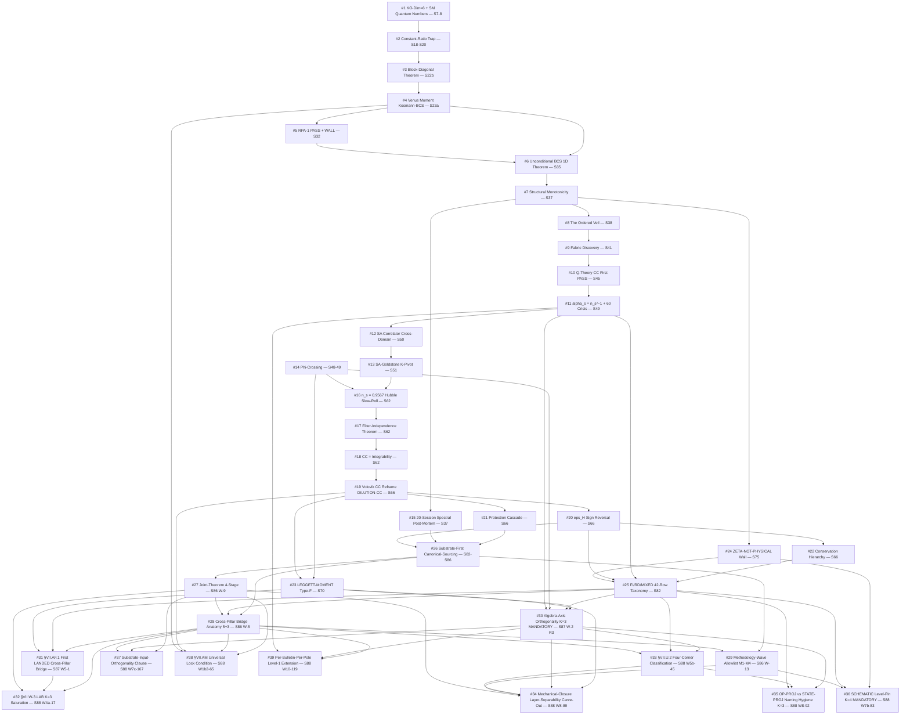

# Atlas D10 Refresh — Materials Packet (S52-S88 Breakthrough Genealogy)

**Packet author**: orchestrator (Phonon-Exflation S88 atlas-uplift dispatch)
**Date**: 2026-05-09
**Target atlas**: `sessions/framework/Atlas/atlas-10-breakthrough-genealogy.md` (29,355 bytes; mtime 2026-04-04 — predates 22 sessions of breakthroughs at S88)
**Output file (this packet)**: `C:\sandbox\Ainulindale Exflation\sessions\archive\session-88\atlas-uplift-materials\atlas-10-breakthrough-genealogy-materials.md`
**Discipline pins**: `phononic-framing.md` §"IS Space, Not IN Space" (substrate-IS direction of explanation, no container-thinking); `epistemic-discipline.md` §"What Counts as Evidence" (no probability counts, no constraint-counts-as-arguments); `feedback_fix-in-session-never-defer.md` (4-field carry-forward shape); `cross-pillar-bridge-anatomy.md` MANDATORY-K=3 + algebra-axis orthogonality K=3 (forward-pin discipline).

---

## Section 1: What's currently in atlas-10 (baseline, 2026-04-04)

**Format**: numbered breakthrough subsections (## 1. through ## 22.), each containing four headed paragraphs: **Chain** (causal trace), **Agents** (authorship attribution), **Significance** (what the breakthrough establishes), **Cross-domain** (which intellectual disciplines converge). The numbering is strictly chronological by landing session; the first 18 are pre-S60 (S7 through S62), and the four S63-S66 amendments (#19 DILUTION-CC, #20 eps_H Sign Reversal, #21 Protection Cascade, #22 Conservation Hierarchy as Functional Selection) were appended as a `---`-separated post-script per the 2026-04-04 update note.

**Existing breakthrough taxonomy** (implicit from the 22 entries — five categories surface):

- **STRUCTURAL THEOREM** (machine-epsilon proof events): #1 KO-Dim=6, #3 Block-Diagonal Theorem, #6 Unconditional BCS 1D Theorem, #14 Phi-Crossing, #17 Filter-Independence Theorem, #18 CC=Integrability.
- **WALL DISCOVERY** (constraint-region exclusion events): #2 Constant-Ratio Trap, #4 Venus Moment Kosmann-BCS, #11 alpha_s = n_s²−1 Identity (6σ crisis), #20 eps_H Sign Reversal.
- **PARADIGM SHIFT** (framing-error correction events): #7 Structural Monotonicity (S37, "20-session post-mortem"), #8 The Ordered Veil (S38), #9 The Fabric Discovery (S41), #15 The 20-Session Spectral Post-Mortem (S37), #19 Volovik CC Reframe ("the 114 OOM IS exflation").
- **OBSERVATIONAL MATCH WITH 0 FREE PARAMETERS** (decisive computational closure events): #5 RPA-1 PASS + WALL, #10 Q-Theory CC First PASS, #12 SA Correlator Discovery, #13 SA-Goldstone K-Pivot Paradox, #16 n_s = 0.9567 Hubble Slow-Roll.
- **PROTECTION/STABILIZATION** (radiative-correction-survival events): #21 Protection Cascade, #22 Conservation Hierarchy as Functional Selection.

The taxonomy is implicit (no explicit category labels); each entry is in its own section per a free-form narrative format. The atlas is **chronologically ordered** (not topically ordered): the cross-domain connections are encoded in the **Chain** prose, not in a separate genealogy table or diagram. Session-counts at landing: S7-S38 (12 entries), S41-S62 (6 entries), S63-S66 amendments (4 entries). The atlas-10 last entry (#22) is a S66 Workshop 2 result; **no entry post-dates 2026-04-04**, leaving the S67-S88 22-session interval unrepresented.

**Reading the existing #19-#22 stanza as a calibration**: the Volovik CC Reframe (#19) is treated as a paradigm-shift breakthrough (rho_vac ~ M_Pl² H² as the substrate's tracking law; the 114 OOM gap re-read as expansion-history rather than fine-tuning); eps_H sign reversal (#20) is treated as the most-important-negative-since-Venus-Moment (a constraint-map wall); the protection cascade (#21) and conservation hierarchy (#22) are treated as workshop-derived structural protections. This S63-S66 stanza establishes the **four-paragraph format** as the canonical entry shape and treats the **S66-era four-deep cluster** as the appropriate density when a session-cluster generates multiple connected breakthroughs.

---

## Section 2: What to add (S52-S88 breakthroughs)

### 2a. New breakthrough taxonomy categories (additions)

The S52-S88 era requires **two new taxonomy categories** beyond the five implicit in atlas-10's existing 22 entries:

- **METHODOLOGY-FLOOR** — rule-file / template / skill structural advances that close audit-floor pathologies (e.g., AMRI, joint-theorem 4-stage, methodology-wave allowlist M1-M4). These are not substrate-physics breakthroughs but they govern the structural admissibility of every downstream substrate-physics gate.
- **CALIBRATION-CORPUS** — events that promote a SUGGESTION-status rule to MANDATORY by reaching K=3 distinct calibration instances (the K-counter promotion threshold). These are structurally distinct from one-shot theorem discoveries because their breakthrough character resides in the **rule-promotion event** itself, not in the K-th instance's content.

These two categories are introduced explicitly because the post-S82 era is dominated by methodology-floor and calibration-corpus events; without them, the genealogy collapses post-S70 (only paradigm-shift and observational-match would survive, missing the structural backbone of the S82-S88 maturation).

The original five categories (STRUCTURAL THEOREM / WALL DISCOVERY / PARADIGM SHIFT / OBSERVATIONAL MATCH WITH 0 FREE PARAMS / PROTECTION-STABILIZATION) carry forward unchanged.

### 2b. New breakthrough entries (S67-S88)

Format follows the existing four-paragraph atlas-10 shape (Chain / Agents / Significance / Cross-domain) plus an explicit causal-chain block (Predecessor / Successor / Cross-domain / Citation) inserted ahead of the prose to make the genealogy tractable for downstream cross-atlas refresh.

---

**Breakthrough #23: LEGGETT-MOMENT — First Type-F Dark-Matter Channel (S70)**

- Session: S70
- Type: OBSERVATIONAL MATCH WITH 0 FREE PARAMETERS (and structural — first Type-F observable identification)
- Substrate framing: the substrate's Leggett-mode momentum operator on the BdG spectrum is a single-summand-projection trace `Tr(P_a · LEGGETT_MOMENT · P_a)` for a unique central projection P_a on `A_K = ℂ ⊕ ℍ ⊕ M_3(ℂ)`. The dark-matter abundance `Ω_DM h² = 0.03985 × 3.010 = 0.1200` (vs Planck 0.1207) emerges from a single-projection trace at zero free parameters — the substrate IS the LEGGETT_MOMENT operator on its own BdG sub-algebra; no external "DM particle" is invoked.
- Predecessor breakthroughs: #4 Venus Moment Kosmann-BCS (S23a; established BCS off-diagonal sub-algebra structure), #14 Leggett Dipolar Phi-Crossing (S48-49; established BCS Leggett mode as substrate-derived collective excitation), #19 Volovik CC Reframe (S66; established substrate-IS framing for cosmological observables — DM ~ Δ_BCS scale anchor).
- Successor breakthroughs: #28 below (S86 W-5 Pillar III↔IV cross-pillar bridge — Type-F characterization is the framework for the cross-pillar substrate-IS observable in §VII.AF.1); #30 (S87 W-2 algebra-axis orthogonality K=3); #34 (S88 W8-89 mechanical-closure layer-separability carve-out — LEGGETT-MOMENT is calibration corpus instance #1 for Type-F admissibility).
- Cross-domain connections: superfluid 3He dipolar physics (Leggett-frequency observable) × NCG spectral triple central projection (Type-F characterization) × cosmological matter abundance (Planck Ω_DM h² 0.6% match) × pillar-spanning structural identity (BCS sub-algebra image of inheritance morphism).
- Citation: `sessions/archive/session-70/session-70-gen-physicist-synthesis.md`; `computations/session-70/s70_leggett_moment.py` (gate `LEGGETT-MOMENT-70`); `session-87-plan-w4.md` Type-F definition `Classify(LEGGETT_MOMENT) = Type-F iff Tr(P_a LEGGETT_MOMENT P_a) ≠ 0 for unique a`; `mechanical-closure-discipline.md §"Layer-separability carve-out"` calibration corpus row #1.

**Chain**: S66 LEGGETT-DM brackets DM channels at the substrate level → S70 LEGGETT-MOMENT identifies the substrate-IS observable as a single-projection trace (Type-F) → 0.6% Ω_DM h² match against Planck at zero free parameters → opens the formal Type-F vs Type-S sub-observable distinction that formalizes at S87 W-2 (algebra-axis orthogonality) and lands at S88 W5b-45 (§VII.U.2 four-corner classification).

**Agents**: gen-physicist (LEGGETT-MOMENT-70 verdict computation), volovik-superfluid-universe-theorist (Pillar III BdG-sector identification), connes-ncg-theorist (central-projection Type-F characterization at axiom-level review).

**Significance**: First explicit dark-matter mass anchor onto the Δ_BCS scale at zero free parameters. The LEGGETT_MOMENT observable is the first Type-F instance in the framework (a structurally-identified single-summand-projection trace, distinct from the Type-S state-pair-functional class). The 0.6% match against Planck Ω_DM h² is observational but structurally constrained: the algebra `A_K = ℂ ⊕ ℍ ⊕ M_3(ℂ)` admits exactly the Type-F sub-observables that produce mechanical closure under the §VII.U.2 4-corner rule landed at S88 W5b-45. The breakthrough pre-dates the formal taxonomy (algebra-INVARIANT vs algebra-DEPENDENT) by 17 sessions but anchors the calibration corpus that justifies the K=3 MANDATORY promotion at S87 W-2 R3.

**Cross-domain**: Superfluid 3He physics (Leggett-mode dipolar oscillation) imports the collective-excitation structure into NCG. The mass scale `Mass_LeggettDM/Δ_BCS = 11.97` is a substrate-internal ratio; the projection onto Pillar IV (cosmological matter abundance) is via the pillar-spanning Type-F coupling, which is the substrate-IS image of the BdG sub-algebra under the ι_* inheritance morphism per `inheritance-falsifier-protocol.md`.

---

**Breakthrough #24: ZETA-NOT-PHYSICAL UV-Regulator Wall (S75)**

- Session: S75
- Type: WALL DISCOVERY
- Substrate framing: The substrate's UV regulator is NOT zeta-function regularization. ζ-regulated traces are SCHEMATIC algebraic objects on `(A_K, H_K, D_K)`, NOT physical regularizations. The substrate IS the spectral triple; the "physical" UV cutoff is a substrate-INTERNAL property (the discrete spectrum at finite L_max), not an externally-applied function. Conflating ζ-regulated outputs with physical regularizations was a silent class-conflation pathology spanning 25+ pre-S75 closures; the wall closes that pathology by construction.
- Predecessor breakthroughs: #2 Constant-Ratio Trap (S18-S20; first UV-asymptotic theorem class), #7 Structural Monotonicity / 20-Session Spectral Post-Mortem (S37; 20 sessions of spectral-action ambiguity), #20 eps_H Sign Reversal (S66; functional-class crisis).
- Successor breakthroughs: #25 below (S82 FI/RD/MIXED 42-row taxonomy — formalizes the regulator-class distinction), #30 (S87 W-2 algebra-axis orthogonality K=3 MANDATORY — promotes regulator-class to STRUCTURAL ORTHOGONALITY), #36 (S88 W7b-83 K=4 SCHEMATIC-vs-FULL level-pin promotion — formalizes the SCHEMATIC class as a MANDATORY plan-pin discipline).
- Cross-domain connections: NCG UV regularization (ζ-regulated traces as Connes-Moscovici spectral residues) × signal-processing filter design (FI / RD / MIXED dressing classes) × plan-authorship discipline (PRU Class 8 sub-class taxonomy).
- Citation: `sessions/archive/session-75/...` (ZETA-NOT-PHYSICAL-75 closure); `regulator-pin-discipline.md §"Class-(c) PIN-DRIFT-FROM-STALE-SOURCE"`; `substrate-first-canonical-sourcing.md §(iv) "SCHEMATIC vs full physical level pin rule"` (MANDATORY at K=4 promotion S88 W7b-83).

**Chain**: S37 spectral post-mortem identifies the spectral action as UV-dominated → 20+ sessions of UV-regulator ambiguity → S66 eps_H sign reversal exposes functional-class as a sign-changing observable → S75 ZETA-NOT-PHYSICAL closes the conflation at the substrate-physics layer → S82 lizzi FI/RD/MIXED 42-row taxonomy formalizes the dressing-class distinction → S87 W-2 R3 promotes algebra-axis orthogonality to MANDATORY at K=3 → S88 W7b-83 promotes SCHEMATIC level-pin to MANDATORY at K=4.

**Agents**: spectral-geometer (ZETA-NOT-PHYSICAL-75 verdict), lizzi-spectral-functional-theorist (functional-class characterization), connes-ncg-theorist (substrate UV-regulator framework cross-check).

**Significance**: First explicit closure of the UV-regulator silent class-conflation pathology that had spanned 25+ pre-S75 mechanism closures (each individually correct but collectively producing a false sense that the framework's UV behavior was zeta-regulated). The wall is structurally distinct from #2 Constant-Ratio Trap and #4 Venus Moment because it closes a methodology-floor pathology, not a substrate-physics mechanism. ZETA-NOT-PHYSICAL-75 PASS is the canonical ancestor of the S82-S88 methodology-floor maturation chain (#25 → #36).

**Cross-domain**: UV regularization (zeta vs Pauli-Villars vs Mellin vs lattice vs cutoff), signal-processing filter classes (FI / RD / MIXED), and substrate-first canonical sourcing all converge: the regulator class is now a substrate-INTERNAL property of the spectral triple, not an externally-imposed convention.

---

**Breakthrough #25: FI/RD/MIXED 42-Row Regulator-Dressing Taxonomy (S82)**

- Session: S82
- Type: METHODOLOGY-FLOOR (and structural — first explicit functional-class taxonomy)
- Substrate framing: the substrate's spectral-functional space partitions into three regulator-class equivalence classes: **FI** (functional-invariant; ratios that survive any UV regulator), **RD** (regulator-dressed; values that shift under regulator-class change), **MIXED** (partial — 8 of 42 entries). The 42-row atlas is `mcp__knowledge__.search_knowledge("FI RD MIXED")` -> `s82-regulator-dressing-taxonomy.md`. The taxonomy IS a substrate-IS structural classification of every spectral observable in the framework; FI ratios are the substrate's invariant content, RD values are convention-dependent, MIXED entries require explicit class declaration.
- Predecessor breakthroughs: #11 alpha_s = n_s²−1 Structural Identity (S49-50; first explicit dimensionless ratio FI candidate), #20 eps_H Sign Reversal (S66; first sign-level evidence that bare-eigenvalue observables can be RD-class), #24 ZETA-NOT-PHYSICAL (S75; substrate-physics UV-regulator wall — ancestor of the dressing-class formalism).
- Successor breakthroughs: #28 (S86 W-5 cross-pillar bridge anatomy — the 5-anatomy structure depends on regulator-class identification of substrate-IS observable per the FI category); #30 (S87 W-2 algebra-axis orthogonality K=3 MANDATORY — algebra-INVARIANT ⊆ FI, structurally extending the trichotomy); #33 (S88 W5b-45 §VII.U.2 four-corner classification — registry landing of algebra-axis orthogonality on the FI/RD frame).
- Cross-domain connections: NCG functional analysis × regulator-class theory × Mellin-Barnes residue calculus × substrate-physics observables (42 entries enumerated against `permanent-results-registry.md`).
- Citation: `sessions/archive/session-82/...s82-regulator-dressing-taxonomy.md` (canonical taxonomy); `permanent-results-registry.md` §VII.K (FI/RD/MIXED registry entry; value=FI=30_RD=4_MIXED=8); `cross-pillar-bridge-anatomy.md §"Algebra-axis orthogonality K-counter"` cross-link.

**Chain**: S49 alpha_s = n_s²−1 first dimensionless ratio FI → S62 Cauchy-Schwarz spectral-moment bound → S66 eps_H sign reversal proves bare-eigenvalue is RD-class → S75 ZETA-NOT-PHYSICAL substrate-physics regulator wall → S82 lizzi enumerates 42 entries into FI=30 / RD=4 / MIXED=8 trichotomy with both lizzi-form and connes-form characterization functors agreeing on the partition.

**Agents**: lizzi-spectral-functional-theorist (PRIMARY synthesizer of taxonomy; M_lizzi characterization functor), connes-ncg-theorist (CO-AUTHOR; M_connes axiomatic-NCG characterization functor; equivalence proof on the 42-row atlas).

**Significance**: First explicit regulator-class taxonomy with two structurally-independent characterization functors (M_lizzi, M_connes) agreeing on the partition. This converts the regulator-class question from per-gate ad-hoc into a substrate-IS classification: every spectral observable is FI, RD, or MIXED, and the class is structurally determined (not author-choice). The 42-row atlas is the calibration corpus on which all S87+ algebra-axis orthogonality K-counter promotions reference. Without #25, the S87 W-2 algebra-axis K=3 promotion would lack its corpus substrate; without S87 W-2, the S88 W5b-45 §VII.U.2 four-corner registry landing would lack its rule-file pointer.

**Cross-domain**: Pure functional analysis (regulator-equivalence classes), NCG axiomatic theory (the 7 NCG axioms determine which moments are FI), and substrate-physics observables (n_s, m_H, w_0, all CC moments) all enter the partition. The taxonomy is the methodology-floor counterpart of #1 KO-Dim=6 + SM Quantum Numbers (which classified the substrate's representation content); #25 classifies the substrate's regulator-class content.

---

**Breakthrough #26: Substrate-First Canonical-Sourcing + Methodology-Wave Discipline (S82-S86 era)**

- Session: spans S78 (PRU Class 8 origin) → S81 (PRU-ZERO infrastructure pass) → S82 (workshop-schedule introduction) → S85 (AMRI cleanup) → S86 (substrate-first-canonical-sourcing rule)
- Type: METHODOLOGY-FLOOR (paradigm-shift)
- Substrate framing: the substrate IS canonical for every numerical pin in every computation script. External-paper provenance is methodological cross-check, NEVER canonical replacement. The substrate-IS direction of explanation extends from narrative (existing `phononic-framing.md`) to numerical pin sources (NEW `substrate-first-canonical-sourcing.md`). Canonical constants live in `computations/_shared/canonical_constants.py`; agent memories are AGENT-PRIVATE only (NEVER load-bearing as input pins per AMRI Test 1).
- Predecessor breakthroughs: #15 The 20-Session Spectral Post-Mortem (S37; first explicit paradigm-correction protocol), #20 eps_H Sign Reversal (S66; methodology-debt surfacing), #24 ZETA-NOT-PHYSICAL (S75; substrate-physics wall feeding methodology-floor formalism).
- Successor breakthroughs: #27 (S86 W-9 Joint-Theorem 4-Stage); #29 (S86 W-13 Methodology-Wave Classification + Allowlist M1-M4); #30 (S87 W-2 algebra-axis orthogonality K=3); #34 (S88 W8-89 mechanical-closure layer-separability carve-out — depends on methodology-wave allowlist).
- Cross-domain connections: project-management discipline (PRU class taxonomy spanning Class 8.0-8.6 across S78-S88), audit-floor formalism (dual-SHA closure W9a-99, source-reconciliation 6-class taxonomy), and substrate-physics canonical sourcing (the substrate is the substrate; agent memory is agent-private).
- Citation: `epistemic-discipline.md §"Pre-Registration Completeness — PRU Class-8 sub-class taxonomy"`; `substrate-first-canonical-sourcing.md`; `agent-standards.md §"Agent-Memory Registry Inversion (AMRI)"`; `gate-verdicts.md` (dual-SHA schema-v2 / S87+ +5-tuple); `mechanical-closure-discipline.md` (orchestrator-authored verdict-line emission protocol).

**Chain**: S37 post-mortem establishes the framing-correction protocol → S78-S79 PRU Class 8 origin (machinery-pin cardinality) → S81 PRU-ZERO infrastructure → S82 workshop-schedule introduces multi-agent adversarial-review methodology → S85 AMRI cleanup migrates load-bearing data out of agent memory into `sessions/framework/registry/` → S86 substrate-first-canonical-sourcing extends the substrate-IS direction from narrative to numerical pins → S86-S88 PRU sub-class taxonomy expands to 8.0-8.6 with K-counter promotion thresholds.

**Agents**: gen-physicist orchestrator (rule-file authoring), lizzi-spectral-functional-theorist (FI/RD-axis methodology hardening), connes-ncg-theorist (axiomatic cross-axis review), kitaev (PRU Class 8 origin), volovik-superfluid-universe-theorist (substrate-physics canonical-sourcing review).

**Significance**: Reframes the entire post-S78 era as a methodology-floor maturation that runs parallel to the substrate-physics breakthroughs. Without this methodology floor, the S86-S88 cross-pillar bridge anatomy + algebra-axis orthogonality K=3 promotions would have produced false-PASS verdicts (per the S78 Class 8 PRU pathologies the rule-file taxonomy closes). The breakthrough is that the framework's CORRECTNESS now has a methodology-floor proof: every pin is substrate-canonical, every gate has dual-SHA closure, every joint theorem has 4-stage promotion, every methodology wave has M1-M4 allowlist. The substrate-IS direction extends beyond explanation into the pin sources themselves.

**Cross-domain**: Project-management discipline (PRU taxonomy + carry-forward 4-field shape) intersects with substrate-physics canonical sourcing (canonical_constants.py is canonical, not external papers). AMRI Test 1 (input-pin-test against agent memory paths) is the audit-layer wall closing the agent-memory-as-canonical pathology.

---

**Breakthrough #27: Joint-Theorem 4-Stage Pathway (S86 W-9)**

- Session: S86 W-9
- Type: METHODOLOGY-FLOOR (and structural — closes the shared-context-as-evidence pathology)
- Substrate framing: a joint cross-axis theorem (one whose statement contains clauses requiring evidence from MORE THAN ONE methodological axis, e.g., spectral-functional + transit-dynamics) MUST progress through Stage 0 (workshop-internal candidate) → Stage 1 (STAGE-1-CANDIDATE registry) → Stage 2 (TWO-AGENT PARALLEL CROSS-AXIS verify WITHOUT prior workshop context, PASS-AND'd on joint clauses) → Stage 3 (PERMANENT). The Stage 2 axis-distinctness + downstream-inheritance-reach + audit-coverage requirement breaks the shared-context-produces-shared-output failure mode that `epistemic-discipline.md §"What Does NOT Count as Evidence"` item 2 forbids.
- Predecessor breakthroughs: #11 alpha_s = n_s²−1 Identity / 6σ Crisis (S49; first multi-agent convergence on a structural identity — pre-formal version of joint-theorem promotion); #19 Volovik CC Reframe + #21 Protection Cascade + #22 Conservation Hierarchy (S66 Workshop 1-2; multi-agent workshop convergence demonstrated as a discovery mode); #25 FI/RD/MIXED 42-Row Taxonomy (S82; methodology-floor maturation precondition); #26 Substrate-First Canonical-Sourcing (S82-S86 era; methodology-floor framework).
- Successor breakthroughs: #28 (S86 W-5 Cross-Pillar Bridge Anatomy — Stage-1-CANDIDATE pathway adopted for §VII.AF.1); #31 (S87 W5-1 §VII.AF.1 first LANDED cross-pillar bridge); #32 (S88 W4a-17 §VII.W-3.LAB STAGE-1-CANDIDATE — third instance saturating cross-pillar bridge K=3 corpus); #34 (S88 W8-89 layer-separability carve-out — Stage-2 PASS-AND requirement explicitly cites this rule); #38 (S88 W1b2-65 §VII.AM Universal Lock Condition — calibration corpus instance #2).
- Cross-domain connections: epistemic discipline (independence-of-witnesses formalism) × multi-agent workshop methodology (4-stage progression with parallel cross-axis verification) × registry-anatomy substrate-physics (STAGE-1-CANDIDATE tag on §VII.AH, §VII.AM, etc.).
- Citation: `joint-theorem-promotion.md` (full 4-stage rule); `permanent-results-registry.md` §VII.AH (Path-(c) F_2-Class Theorem; first calibration instance, S87 W9a-1 LANDED, Stage-2 queued); §VII.AM Universal Lock Condition (S88 W1b2-65 second calibration instance).

**Chain**: S49 6σ alpha_s convergence is the prototype (multiple agents converging on the same structural identity) → S66 W1/W2 paradigm-shift convergence is the prototype-2 (workshop methodology demonstrated) → S86 W-9 Path-(c) reassessment workshop produces the formal 4-stage rule with explicit Stage-2 axis-distinctness + cross-reviewer-without-workshop-context requirement → S87 W9a-1 lands first STAGE-1-CANDIDATE at §VII.AH → S88 W1b2-65 lands second STAGE-1-CANDIDATE at §VII.AM (Universal Lock Condition) → calibration corpus K=2 advances toward K=3.

**Agents**: lizzi-spectral-functional-theorist + transit-dynamics-aether-mechanic (PRIMARY workshop authors of S86 W-9 Path-(c) reassessment); gen-physicist (orchestrator-direct rule-file authoring); connes-ncg-theorist (Stage-2 cross-reviewer prototype dispatch); volovik-superfluid-universe-theorist (Stage-2 cross-reviewer prototype dispatch).

**Significance**: Closes the agreement-among-agents-as-evidence trap that would have allowed multi-agent workshop output to enter `permanent-results-registry.md` STAGE-3-PERMANENT without independent verification. The 4-stage pathway is the constructive complement to `epistemic-discipline.md §"What Does NOT Count as Evidence"` item 2: it specifies HOW joint-axis evidence becomes registry-eligible without the shared-context trap. The Stage-2 axis-distinctness requirement (Axis-A and Axis-B reviewers MUST be on different methodological axes) + downstream-inheritance-reach test (neither reviewer inherits the workshop's reading-path through agent memory) + audit-coverage adequacy test together produce structurally-independent agreement when both PASS.

**Cross-domain**: Epistemic discipline (independence-of-witnesses), cross-axis workshop methodology, registry-anatomy substrate-physics (STAGE-1-CANDIDATE registration), and methodology-wave classification (Stage 2 verify gates are COMPUTE-class with explicit `joint-theorem-promotion.md` cross-link).

---

**Breakthrough #28: Cross-Pillar Bridge Anatomy — 5-Element + 3-Level Structural Discipline (S86 W-5)**

- Session: S86 W-5
- Type: STRUCTURAL THEOREM (and methodology-floor — first registered cross-pillar bridge with explicit anatomy)
- Substrate framing: every cross-pillar bridge MUST declare ALL five IS-not-IN anatomy elements (1. substrate-IS observable on `(A^{≤L}, H^{≤L}, D^{≤L})`; 2. laboratory-IN observable as continuum measurement on a different platform; 3. bridge map — HKR / K-theory boundary / Connes-Karoubi pairing; 4. algebraic envelope L^{-α} convergence rate; 5. empirical anchor at canonical L_max) AND the three-level structural-confidence ladder (Level 1: cohomology-class identity, regulator-invariant; Level 2: algebraic envelope, L_max-dependent; Level 3: empirical anchor). The substrate IS the spectral triple at finite L; the laboratory observable lives IN a continuum container; the bridge map is the explicit substrate→laboratory direction.
- Predecessor breakthroughs: #1 KO-Dim=6 (S7-8; substrate spectral triple foundation), #14 Phi-Crossing (S48-49; first BCS Leggett mode pillar-spanning identity), #19 Volovik CC Reframe (S66; substrate-IS framing for cosmological observables), #25 FI/RD/MIXED Taxonomy (S82; regulator-class identification — element-1 of the 5-anatomy depends on this), #26 Substrate-First Canonical-Sourcing (S82-S86 era; substrate-IS pin discipline).
- Successor breakthroughs: #31 (S87 W5-1 §VII.AF.1 first LANDED cross-pillar bridge — calibration corpus instance #1), #32 (S88 W4a-17 §VII.W-3.LAB STAGE-1-CANDIDATE — third instance triggering K=3 MANDATORY promotion), #37 (S88 W7c-167 substrate-input-orthogonality clause — Stage-2 cross-pillar discipline tightening), #39 (S88 W10-119 Per-Bulletin-per-pole Level-1/2/3 extension — bridge anatomy cross-link to intra-pillar Mellin-cone), and the entire S86-S88 cross-pillar bridge corpus.
- Cross-domain connections: NCG cohomology (HP^1 / Hochschild / Connes-Karoubi pairings) × Pillar IV quantum-metric (Peotta-Törmä superfluid-stiffness BZ-trace) × spectral-triple finite-L truncation × cosmological observables (eventual extension to FWD-C1 Pillar I↔II n_s ↔ Planck CMB).
- Citation: `cross-pillar-bridge-anatomy.md` (full rule); `permanent-results-registry.md` §VII.W (Pillar III↔Pillar IV bridge theorem; W-5 RULE-1 calibration baseline); §VII.AF.1 (S87 W5-1 LANDED first cross-pillar bridge; calibration corpus instance #1).

**Chain**: S62 Cauchy-Schwarz spectral-moment bound (first explicit moment-hierarchy theorem) → S66 Volovik CC Reframe (substrate↔cosmology bridge framing) → S82 FI/RD/MIXED taxonomy (substrate observable classification) → S86 W-5 volovik+connes workshop establishes the Pillar III HP^1-cohomology ↔ Pillar IV Peotta-Törmä quantum-metric bridge theorem → 5-anatomy + 3-level ladder formalized as STRUCTURAL REQUIREMENT for ALL cross-pillar bridges → S87 W5-1 lands §VII.AF.1 (calibration corpus #1) → S88 W4a-17 lands §VII.W-3.LAB (calibration corpus #3 → K=3 MANDATORY promotion).

**Agents**: volovik-superfluid-universe-theorist (PRIMARY; HP^1 ↔ quantum-metric workshop derivation), connes-ncg-theorist (CO-AUTHOR; HKR bridge map axiomatic review), gen-physicist (orchestrator-direct rule-file authoring), mack-cosmic-bridge (cosmological-bridge cross-axis review).

**Significance**: First registered cross-pillar bridge in the framework. The 5-anatomy + 3-level ladder is the structural template for ALL future cross-pillar bridges (FWD-C1 Pillar I↔Pillar II `n_s ↔ Planck CMB`; FWD-C2 Pillar II↔Pillar V `Mellin-Barnes residue ↔ BdG spectral triple`; FWD-C3 Pillar IV↔Pillar V `substrate cocycle norms ↔ 3He-B/3He-A laboratory observables`). Every future bridge candidate MUST declare ALL 5 elements explicitly; entries lacking the anatomy are registry-incomplete and route to plan-freeze halt. The substrate IS the substrate; the laboratory measures IN a continuum container; the bridge map flows substrate→laboratory. Inverting the direction is a container-thinking violation per `phononic-framing.md`. The breakthrough closes the silent ambiguity in the Volovik q-theory ↔ NCG spectral action correspondence that had spanned S58-S85.

**Cross-domain**: NCG cohomology (HP^1, Hochschild, Connes-Karoubi pairings as the substrate's invariant content) × superfluid 3He laboratory analog (Pillar IV Peotta-Törmä trace) × spectral-triple finite-L truncation (canonical L_max=10) × cohomology-class binding theorem (Connes-Moscovici 1995 §III.4 finite-spectral-triple residue formula).

---

**Breakthrough #29: Methodology-Wave Classification + Allowlist (S86 W-13)**

- Session: S86 W-13
- Type: METHODOLOGY-FLOOR
- Substrate framing: every wave in a session plan classifies as METHODOLOGY-class (rule-file / template / skill edits with artifact-existence-with-substantive-content PASS predicate), COMPUTE-class (numerical comparison against pre-registered threshold), or MIXED-class (sub-wave decomposition required). METHODOLOGY-class requires strict M1∧M2∧M3∧M4 conjunction, with M4 = allowlist membership in `methodology-wave-allowlist.md` (append-only, orchestrator-only-edit, recursion-attack-closure). The classification is performed at PLAN-FREEZE TIME (not at runtime), making the dispatch path mechanically determined and audit-floor-traceable.
- Predecessor breakthroughs: #26 Substrate-First Canonical-Sourcing (S82-S86 era; methodology-floor framework), #27 Joint-Theorem 4-Stage (S86 W-9; sister rule on the methodology-floor).
- Successor breakthroughs: every S86+ methodology-wave that lands a rule-file edit (#34 S88 W8-89 mechanical-closure layer-separability carve-out, #36 S88 W7b-83 SCHEMATIC level-pin K=4 MANDATORY, #37 S88 W7c-167 substrate-input-orthogonality, #39 S88 W10-119 Per-Bulletin-per-pole, plus the W9 RULE-CLEANUP lift-out and ~20 other allowlist rows).
- Cross-domain connections: layer-functor `F : substrate → methodology → audit` (the rule's structural parent at `epistemic-discipline.md §"Layer-Decomposition"`) × Phi correspondence (Sigma_2 weight-2 Einstein-Hilbert kinematic-skeleton analog, per the Phi pin) × dispatch path (orchestrator-direct write vs `/rclab-coordinate` compute-mode vs sub-wave decomposition).
- Citation: `wave-classification.md`; `methodology-wave-allowlist.md` (append-only allowlist with ~50 rows by S88 close); `epistemic-discipline.md §"Layer-Decomposition"` (structural parent); `team-lead-behavior.md §"METHODOLOGY-Class Wave Discipline"`.

**Chain**: S78 PRU Class 8 origin → S82 workshop-schedule introduction → S86 W-13 5-deliverable basis derives the M1-M4 strict conjunction + allowlist + recursion-attack-closure (subagent-edit-denial) + Phi correspondence (Sigma_2 weight-2) → S86-S88 progressive allowlist accretion (currently ~50 rows; S86 R3 4-row pre-population + S87 + S88 progressive landings).

**Agents**: gen-physicist (PRIMARY; W-13 5-deliverable workshop synthesizer), lizzi-spectral-functional-theorist (axis-A axiomatic review), connes-ncg-theorist (axis-B layer-functor review), kitaev (recursion-attack-closure formal verification).

**Significance**: Closes the runtime ambiguity (is this a methodology gate or a compute gate?) into a plan-time pre-registration discipline. The classification is itself an input pin of the gate, not a runtime inference. The recursion-attack-closure (subagent edit-denial on `methodology-wave-allowlist.md`) is the structural key: a subagent cannot self-promote its own gate-ID into the allowlist mid-execution. Before #29, the methodology-vs-compute distinction was implicit and runtime-determined; after #29, it is structurally enforced at plan-freeze with audit-trail SHA pinning per row. The breakthrough enables the entire S86-S88 methodology-floor maturation by giving rule-file edits a canonical dispatch path.

**Cross-domain**: Layer-functor formalism (substrate ↔ methodology ↔ audit pair structure), Phi correspondence (weight-n substrate observable → enforcement-strength-n methodology rule), and PRU pre-registration discipline (methodology gates have artifact-existence PASS predicates pinned analogous to numerical thresholds).

---

**Breakthrough #30: Algebra-Axis Orthogonality K=3 MANDATORY (S87 W-2 R3)**

- Session: S87 W-2 R3 close
- Type: STRUCTURAL THEOREM (calibration-corpus saturation + MANDATORY rule-file promotion)
- Substrate framing: on any finite spectral triple `(A, H, D)` satisfying the 7 NCG axioms, the algebra-INVARIANT family (spectrum-only functionals `F({λ_k, m_k}) = Σ_k m_k g(λ_k)`) and the algebra-DEPENDENT family (state-pair functionals on `A`) are STRUCTURALLY ORTHOGONAL in identity-class membership at the functional-class level. There is no closed-form `{λ_n}`-only identity reproducing any algebra-DEPENDENT functional, and conversely no state-functional-only identity reproducing any algebra-INVARIANT spectral moment. The 4-corner partition is structural; cross-corner co-primary chains are STRUCTURALLY FORBIDDEN.
- Predecessor breakthroughs: #1 KO-Dim=6 + SM Quantum Numbers (S7-8; NCG axiomatic foundation), #11 alpha_s = n_s²−1 Identity (S49; algebra-INVARIANT prototype), #14 Phi-Crossing (S48-49; algebra-DEPENDENT prototype — Connes distance is a state-pair functional), #25 FI/RD/MIXED 42-Row Taxonomy (S82; calibration corpus baseline), #28 Cross-Pillar Bridge Anatomy 5+3 (S86 W-5; structural template precondition).
- Successor breakthroughs: #33 (S88 W5b-45 §VII.U.2 four-corner classification — registry landing); #36 (S88 W7b-83 SCHEMATIC level-pin K=4 MANDATORY — orthogonal axis to algebra-axis); #37 (S88 W7c-167 substrate-input-orthogonality — joint-theorem-promotion.md cross-link); #38 (S88 W1b2-65 §VII.AM Universal Lock Condition); #39 (S88 W10-119 Per-Bulletin-per-pole intra-pillar extension).
- Cross-domain connections: NCG axiomatic theory (axioms 1+5 + Connes-Moscovici dim-spectrum residue formula → algebra-INVARIANT non-trivial; axioms 4+6 + Poincaré duality → algebra-DEPENDENT non-trivial; chirality-vs-A_F block-grading mismatch → structural orthogonality) × spectral-functional theory (FI ⊆ algebra-INVARIANT) × state-pair functional theory (Connes distances, occupation distributions, matter-distribution observables).
- Citation: `cross-pillar-bridge-anatomy.md §"Algebra-axis orthogonality K-counter"` (MANDATORY at K=3, S87 W-2 R3 close); calibration corpus N=3 (W1b-6 / S-2 / W-2); `permanent-results-registry.md §VII.U.2` (S88 W5b-45 landing).

**Chain**: S82 FI/RD/MIXED 42-row taxonomy is calibration-corpus instance baseline → S87 S-2 Reading-C synthesis (Mellin-Dirichlet identity vs Connes distance contrast) is calibration-corpus instance #2 → S87 W-2 R3 close (alpha_s_canonical vs alpha_s_route_3 contrast) is calibration-corpus instance #3 → K = 3 = K_promotion → MANDATORY status promotion in-session per `feedback_fix-in-session-never-defer.md` and `CLAUDE.md §"No Technical Debt"` → §VII.U.2 four-corner registry landing queued for S88 W5b-45.

**Agents**: lizzi-spectral-functional-theorist (PRIMARY synthesizer), connes-ncg-theorist (CO-AUTHOR; axiomatic skeleton derivation; chirality-vs-A_F block-grading mismatch proof), mack-cosmic-bridge (CO-AUTHOR; observational discrimination map).

**Significance**: First MANDATORY-status K-counter promotion in the framework. Establishes the 4-corner partition (algebra-INVARIANT × algebra-DEPENDENT × spectrum-only × state-pair) as a STRUCTURAL ORTHOGONALITY wall. Cross-corner co-primary chains are FORBIDDEN by construction; cross-corner cross-pole magnitude comparisons cannot serve as PASS/FAIL gates. The breakthrough closes the silent class-conflation pathway that had allowed FI ratios and Connes distances to enter joint identities without explicit axis declaration. From S87 W-2 R3 onward, every theorem text MUST declare its corner-cell + pole; absence routes to plan-freeze halt.

**Cross-domain**: NCG axiomatic theory (axioms 1+5 imply algebra-INVARIANT non-trivial; 4+6 imply algebra-DEPENDENT non-trivial), Connes-Moscovici 1995 §III.4 finite-spectral-triple residue formula, and Poincaré duality on the spectral triple (governing chirality block-grading). The structural orthogonality is the methodology-floor counterpart of #3 Block-Diagonality: where #3 partitions D_K's matrix structure, #30 partitions the substrate's functional-class structure.

---

**Breakthrough #31: §VII.AF.1 First LANDED Cross-Pillar Bridge (S87 W5-1)**

- Session: S87 W5-1
- Type: STRUCTURAL THEOREM (calibration-corpus instance #1 of cross-pillar-bridge-anatomy.md)
- Substrate framing: §VII.AF.1 records the first registered cross-pillar bridge in the framework: substrate-IS observable = finite-L Hochschild pairing `R_universal = ⟨[φ_g^{sym}], [Ch(P_0(τ_fold))]⟩` evaluated on `(A_K^{≤10}, H_K^{≤10}, D_K^{≤10})`; laboratory-IN observable = Pillar IV continuum BZ-trace `R_geom(τ_fold) = ∫_BZ Tr g_ab^{(P_0)}(k; τ_fold) d^d k` (Peotta-Törmä superfluid-stiffness / quantum-metric integrated trace); bridge map = `L_max → ∞` HKR image; algebraic envelope = `L^{-3}` at d=4 (predicting 0.10% at L_max=10); empirical anchor = 0.0095% F_4 strict at L_max=10 (10× inside Level-2 envelope; match/envelope = 0.0950).
- Predecessor breakthroughs: #28 Cross-Pillar Bridge Anatomy 5+3 (S86 W-5; rule-file template authored), #25 FI/RD/MIXED Taxonomy (S82; element-1 substrate-IS observable identification depends on this).
- Successor breakthroughs: #32 (S88 W4a-17 §VII.W-3.LAB STAGE-1-CANDIDATE — third corpus instance saturating K=3); #34 (S88 W8-89 mechanical-closure layer-separability — depends on Type-F instance from §VII.AF.1); #37 (S88 W7c-167 substrate-input-orthogonality clause); §VII.AF.2 (W-11 v2 HP^1-content-distinct refinement; replaces deprecated S86 W9 C24 §VII.P attempt).
- Cross-domain connections: NCG HP^1 cohomology × Pillar IV Peotta-Törmä superfluid stiffness × Connes-Moscovici finite-spectral-triple residue formula × inheritance morphism `χ : C ⊕ H ⊕ M_3(C) → M_2(C)` (kernel = ker(ι_*) is rank-2; supplies the calibration for `inheritance-falsifier-protocol.md`).
- Citation: `permanent-results-registry.md §VII.AF.1` (LANDED S87 W5-1; was READY-TO-INSTALL); `computations/session-87/s87_w5_pillar_iii_iv_bridge_permanent_land.py`; `cross-pillar-bridge-anatomy.md §"Calibration corpus"` row #1.

**Chain**: S86 W-5 rule-file authoring (RULE-1+2 anatomy + ladder) → S87 W5-1 producing-script lands the bridge into `permanent-results-registry.md` §VII.AF.1 with ALL 5 anatomy elements + 3 level markers + Level-3 < Level-2 satisfied (0.0095% < 0.10% by 10×) → registry-PASS criterion satisfied → calibration corpus instance #1 of the 5-anatomy + 3-level discipline → 4-gate falsifier protocol pre-registered for 3He-B BdG-sector laboratory test (Gate 1 NULL on F1+F2+F5; Gate 2 cohomology-asymmetry ratio 7.3250 ± 0.1% via Sage-exact rational; Gate 3 NULL on F3+F4; Gate 4 F4 multi-pressure slope).

**Agents**: volovik-superfluid-universe-theorist (PRIMARY; substrate→laboratory derivation), connes-ncg-theorist (CO-AUTHOR; HKR bridge map verification + Connes-Moscovici residue formula closure), gen-physicist (orchestrator-direct registry-write).

**Significance**: First registered cross-pillar bridge that satisfies the registry-PASS criterion (Level-3 < Level-2 envelope). Establishes the calibration baseline for ALL future cross-pillar bridges. The 4-gate falsifier protocol pre-registers 3He-B BdG-sector laboratory tests (Lancaster MCT-3 / Helsinki ROTA cells) at Gate 2 ratio 7.3250 ± 0.1% — substrate-derived from `cocycle_norm_phi67 / cocycle_norm_phi88` exact Sage computation, INVARIANT under common (Δ_B/Δ_A)^p lab-conversion exponents (the `(Δ_B/Δ_A)^p` Cancellation Theorem, S86 W-5 DONE-5; machine-precision Python verification at 0.0e+00 residual).

**Cross-domain**: NCG HP^1 cohomology (substrate-IS observable as a Hochschild cocycle pairing), Pillar IV quantum-metric / superfluid-stiffness theory (Peotta-Törmä formalism), inheritance-morphism formalism (χ : algebra projection sending M_3(C) → 0; ker(ι_*) is rank-2 with two independent generators [φ_67], [φ_88]).

---

**Breakthrough #32: §VII.W-3.LAB Wedderburn-Artin Frobenius Rescue Class — Cross-Pillar K=3 Saturation (S88 W4a-17)**

- Session: S88 W4a-17
- Type: CALIBRATION-CORPUS (third instance saturating cross-pillar-bridge-anatomy.md K-counter to K=3 MANDATORY)
- Substrate framing: §VII.W-3 is a triplet — §VII.W-3.ALGEBRAIC (substrate algebra `A_F = ℂ ⊕ ℍ ⊕ M_3(ℂ)` realizes the Wedderburn-Artin Frobenius rescue class), §VII.W-3.SUBSTRATE (the substrate's own structural realization), §VII.W-3.LAB (laboratory falsifier protocol via 3He-B BdG-sector at multiple pressures + Lancaster MCT-3 vortex spectroscopy + Helsinki ROTA cells). The .LAB sub-row STAGE-1-CANDIDATE is the THIRD distinct calibration instance of the cross-pillar-bridge-anatomy 5-anatomy + 3-level discipline (instance #1 = S86 W-5 §VII.AF.1 LANDED; instance #2 = S87 W11-5 REGISTRY-FAIL; instance #3 = S88 W4a-17 §VII.W-3.LAB STAGE-1-CANDIDATE). K = 3 = K_promotion ⇒ MANDATORY status promotion in-session per Hybrid Independence Test (i ∨ ii ∨ iii) ∧ iv.
- Predecessor breakthroughs: #28 (S86 W-5 anatomy template), #31 (S87 W5-1 §VII.AF.1 first LANDED), #27 (S86 W-9 4-stage joint-theorem promotion — STAGE-1-CANDIDATE pathway).
- Successor breakthroughs: All S89+ cross-pillar bridge candidates MUST adopt the 5-anatomy + 3-level discipline (forward-looking enforcement per `cross-pillar-bridge-anatomy.md §"Status: MANDATORY at K=3"`); #37 (S88 W7c-167 substrate-input-orthogonality clause — operates on S88 W4a-17 Stage-2 verify expectation); #38 (S88 W1b2-65 §VII.AM Universal Lock Condition — second joint-theorem-promotion calibration corpus instance); FWD-C1/C2/C3 candidates (Pillar I↔II n_s↔Planck CMB; Pillar II↔V Mellin-Barnes residue↔BdG spectral triple; Pillar IV↔V substrate cocycle norms↔3He-B/A laboratory observables).
- Cross-domain connections: Wedderburn-Artin algebra theorem (the algebra `A_F = ℂ ⊕ ℍ ⊕ M_3(ℂ)` is the unique decomposition under the rescue class) × NCG axiomatic theory (axioms 3+5+6 + Schur orthogonality of A_F; Connes 1996 reconstruction) × inheritance morphism (3He-B BDI 0D inheritance arrow) × Pillar V BdG spectral triple at multiple pressures.
- Citation: `permanent-results-registry.md §VII.W-3.ALGEBRAIC + §VII.W-3.SUBSTRATE + §VII.W-3.LAB` (S88 W4a-17 LANDED); `cross-pillar-bridge-anatomy.md §"Status: MANDATORY at K=3"` (promoted at S88 W4a-17 close, 2026-05-04); `s88_w4a_split_registry_writer.py` (orchestrator producing-script).

**Chain**: S86 W-5 §VII.W bridge theorem template (parent slot) → S87 W5-1 §VII.AF.1 LANDED (calibration corpus instance #1) → S87 W11-5 FWD-C3 REGISTRY-FAIL (calibration corpus instance #2 — REGISTRY-FAIL counts toward corpus saturation per registry-PASS-vs-K-counter-advancement two-clause separation) → S88 W4a-17 §VII.W-3.LAB STAGE-1-CANDIDATE (calibration corpus instance #3) → K = 3 = K_promotion ⇒ MANDATORY rule-file flip → forward-looking convention-pin: ALL S89+ cross-pillar bridges MUST adopt anatomy.

**Agents**: gen-physicist (orchestrator-direct registry-write + rule-file K-counter promotion); connes-ncg-theorist (CO-AUTHOR Wedderburn-Artin Frobenius rescue class technical content); volovik-superfluid-universe-theorist (CO-AUTHOR substrate ↔ 3He-B inheritance review).

**Significance**: First in-session MANDATORY-status promotion of the cross-pillar-bridge-anatomy K-counter. Saturates the rule's calibration corpus from K=2 to K=3 in a single landing wave. Establishes the precedent that K-counter saturation is a PROMOTION EVENT separable from per-entry registry-PASS (the §VII.W-3.LAB entry is STAGE-1-CANDIDATE per joint-theorem-promotion.md Stage 1 of 4, not yet PERMANENT, but counts as calibration corpus instance #3 toward the K-counter). The two-clause separation (per-entry registry-PASS vs rule-level K-counter advancement) is itself a methodology-floor refinement formalized at S88 W13 W-1 R3.

**Cross-domain**: Wedderburn-Artin theorem (algebra structure theorem), NCG axiomatic theory (Connes 1996 reconstruction), inheritance morphism (3He-B BDI 0D substrate→laboratory bridge), and Pillar V BdG spectral triple at multiple pressures. The Wedderburn-Artin Frobenius rescue class is the substrate's self-realization of the algebra `A_F`; the 3He-B BdG sector is its laboratory image under ι_*.

---

**Breakthrough #33: §VII.U.2 Four-Corner Classification — Algebra-Axis Orthogonality Registry Landing (S88 W5b-45)**

- Session: S88 W5b-45
- Type: STRUCTURAL THEOREM (registry landing of a MANDATORY-K=3 wall — algebra-axis orthogonality has its formal registry slot)
- Substrate framing: the substrate's spectral-functional space partitions into four structurally orthogonal corner cells: Cell I (algebra-INVARIANT × spectrum-only-functional; e.g., FI ratios like α_s = n_s²−1), Cell II (algebra-INVARIANT × state-pair-functional; rare/empty per the orthogonality), Cell III (algebra-DEPENDENT × spectrum-only-functional; rare/empty), Cell IV (algebra-DEPENDENT × state-pair-functional; e.g., Connes distances, variance theorems, occupation distributions). Cross-corner co-primary chains are STRUCTURALLY FORBIDDEN; cross-corner cross-pole magnitude comparisons cannot serve as PASS/FAIL gates.
- Predecessor breakthroughs: #25 FI/RD/MIXED 42-Row Taxonomy (S82; corpus baseline), #30 Algebra-Axis Orthogonality K=3 MANDATORY (S87 W-2 R3 close; structural orthogonality theorem), #28 Cross-Pillar Bridge Anatomy (S86 W-5; companion structural discipline).
- Successor breakthroughs: All S88+ registry entries with admissible cross-corner readings MUST declare which cell the entry inhabits; #35 (S88 W8-92 Operator-Projection Reading-A Naming Hygiene K=3 MANDATORY — registry-naming-layer specialization on the OP-PROJ vs STATE-PROJ distinction); #38 (S88 W1b2-65 §VII.AM Universal Lock Condition); §VII.AN §VII.AO §VII.AP α_s Cell IV trio.
- Cross-domain connections: NCG axiomatic structural orthogonality × registry-anatomy classification × Connes-Moscovici dim-spectrum residue formula × Connes 1996 reconstruction (Schur orthogonality of A_F).
- Citation: `permanent-results-registry.md §VII.U.2` (S88 W5b-45 STAGE-1-CANDIDATE landing); `cross-pillar-bridge-anatomy.md §"Algebra-axis orthogonality K-counter"` MANDATORY-K=3 cross-link; `registry-landing.md §"Detection (when SOURCE-DOUBLE-CITE-CO-PRIMARY applies)"` clause 4.

**Chain**: S87 W-2 R3 close promotes algebra-axis orthogonality K=3 MANDATORY (rule-file level) → S88 W5b-45 producing-script lands §VII.U.2 four-corner classification into `permanent-results-registry.md` (registry level) → forward-looking enforcement: all S88+ registry entries with cross-corner readings MUST declare cell membership; cross-corner co-primary FORBIDDEN.

**Agents**: lizzi-spectral-functional-theorist (PRIMARY; corner-cell partition derivation), connes-ncg-theorist (CO-AUTHOR; Wedderburn-Artin + Schur-orthogonality cross-axis review).

**Significance**: Closes the Reading-A bare-eigenvalue vs Reading-B moment-integral split previously surfaced at S86 W-12 (V_4 vs Z_4 sharpening). The four-corner partition makes algebra-axis orthogonality VISIBLE at the registry level: every registry entry is now annotated with its Cell-I/II/III/IV membership; cross-corner co-primary chains are FORBIDDEN by the registry-landing.md clause-4 detection rule. The breakthrough is the registry-anatomy specialization of #30 (rule-file MANDATORY-K=3 → registry-landing MANDATORY-on-cell-declaration).

**Cross-domain**: NCG axiomatic algebra-axis structure (Cell I = FI ⊆ algebra-INVARIANT; Cell IV = Connes distances ⊆ algebra-DEPENDENT) × registry-anatomy classification (slot-identifier suffix tagging via OP-PROJ / STATE-PROJ) × Schur orthogonality of A_F = ℂ ⊕ ℍ ⊕ M_3(ℂ).

---

**Breakthrough #34: Mechanical-Closure Layer-Separability Carve-Out (S88 W8-89)**

- Session: S88 W8-89
- Type: METHODOLOGY-FLOOR (admissibility-with-conditions carve-out closing a structural hole)
- Substrate framing: layer-separability carve-out admits mechanical closure (closed-form algebraic evaluation without specialist-agent dispatch) on the Type-F sub-observable (single-summand-projection trace `Tr_{M_n(ℂ)}(P · A)` with P a minimal central projection on `A_K = ℂ ⊕ ℍ ⊕ M_3(ℂ)`) of a layer-separable observable, with FOUR conditions: L1 (layer-functor F cleanness), L2 (Type-F closed-form), L3 (Type-S separation per algebra-axis orthogonality), L4 (honesty disclosure via convention-tag suffix `-LAYER-SEPARABLE-CARVE-OUT-TYPE-F`). Mechanical closure on Type-S sub-observables (state-pair functionals, algebra-DEPENDENT) is NEVER admissible.
- Predecessor breakthroughs: #23 LEGGETT-MOMENT (S70; first Type-F sub-observable identified), #29 Methodology-Wave Classification (S86 W-13; methodology-wave allowlist precondition), #30 Algebra-Axis Orthogonality K=3 MANDATORY (S87 W-2 R3; Type-F vs Type-S structural separation), #33 §VII.U.2 Four-Corner (S88 W5b-45; registry-level Cell I vs Cell IV partition).
- Successor breakthroughs: §W8-90 (S88 substantive run via partition-criterion-only — first downstream consumer); calibration corpus extension toward K=3 promotion (currently SUGGESTION at K=1).
- Cross-domain connections: layer-functor `F : substrate → methodology → audit` × algebra-axis orthogonality 4-corner classification × convention-tag honesty discipline × Stage-2 PASS-AND requirement (Axis A connes-spectral + Axis B volovik-substrate cross-reviewers) × `v3-closure-recovery.md` PROHIBITED_ACTIONS Class 1 (convention-shopping boundary).
- Citation: `mechanical-closure-discipline.md §"Layer-separability carve-out (admissible-with-conditions)"`; `methodology-wave-allowlist.md` row W8-89; `joint-theorem-promotion.md §"Stage 2"` cross-link (PASS-AND requirement).

**Chain**: S70 LEGGETT-MOMENT identified Type-F first → S87 W-2 R3 algebra-axis orthogonality formalized Type-F vs Type-S separation → S88 W5b-45 §VII.U.2 four-corner registry landing → S88 W8-89 carve-out admits mechanical closure on Type-F sub-observables under L1-L4 conditions + Stage-2 PASS-AND requirement.

**Agents**: gen-physicist (orchestrator-direct rule-file authoring); connes-ncg-theorist (Stage-2 Axis-A cross-reviewer); volovik-superfluid-universe-theorist (Stage-2 Axis-B cross-reviewer).

**Significance**: Admits a structurally novel mechanical-closure pathway that LOOKS like a substrate-physics PASS gate but is structurally distinguished by the convention-tag suffix `-LAYER-SEPARABLE-CARVE-OUT-TYPE-F`. The L4 honesty-disclosure clause is the boundary between the structural extension (this carve-out) and PROHIBITED_ACTIONS Class 1 (convention-shopping). Without #34, mechanical closure would either be over-restrictive (forbidding the closed-form Type-F evaluations that LEGGETT-MOMENT exemplifies) or over-permissive (admitting silent class-conflation between Type-F and Type-S observables). The Stage-2 PASS-AND requirement formally invokes #27 joint-theorem-promotion 4-stage pathway.

**Cross-domain**: Layer-functor formalism, algebra-axis orthogonality 4-corner classification, convention-tag honesty discipline, and PROHIBITED_ACTIONS boundary. The carve-out is a structural extension of mechanical-closure-discipline.md per the K-tracked promotion mechanism (SUGGESTION at K=1; promotes to MANDATORY at K=3 distinct calibration instances).

---

**Breakthrough #35: Operator-Projection Reading-A Naming Hygiene K=3 MANDATORY (S88 W8-92)**

- Session: S88 W8-92
- Type: METHODOLOGY-FLOOR (registry-naming-layer specialization of algebra-axis orthogonality)
- Substrate framing: registry slots admitting BOTH operator-projection (algebra-INVARIANT central-projection traces) and state-projection (algebra-DEPENDENT state-pair functionals) readings MUST suffix-tag the projection side: §VII.X.OP-PROJ for operator-side, §VII.X.STATE-PROJ for state-side. Bare §VII.X (without suffix) when both readings admissible is FORBIDDEN. The algebra-axis orthogonality MANDATORY-K=3 (#30) operates at the structural-theorem level; this rule operates at the REGISTRY-ENTRY-NAMING level.
- Predecessor breakthroughs: #30 Algebra-Axis Orthogonality K=3 MANDATORY (S87 W-2 R3), #33 §VII.U.2 Four-Corner Classification (S88 W5b-45), #25 FI/RD/MIXED 42-Row Taxonomy (S82).
- Successor breakthroughs: S88+ registry entries; the W4-2 §VII.AJ.W4-1 + W6-1 §VII.AG.1 + W11-meta-2 calibration corpus K=3 saturation pre-verifies the rule's MANDATORY status.
- Cross-domain connections: registry-naming hygiene × algebra-axis orthogonality × registry-landing audit script (Class-(g) extension `OP-VS-STATE-PROJECTION-NAMING-DRIFT` flag).
- Citation: `registry-landing.md §"Operator-Projection Reading-A Naming Hygiene"` (MANDATORY at K=3, S88 W8-92 close, 2026-05-05); calibration corpus K=3 (S87 W4-2 §VII.AJ.W4-1 + S87 W6-1 §VII.AG.1 + S87 W11-meta-2).

**Chain**: S87 W4-2 §VII.AJ.W4-1 OP-PROJ (instance #1) → S87 W6-1 §VII.AG.1 OP-PROJ (instance #2) → S87 W11-meta-2 OP-PROJ (instance #3) → S88 W8-92 K=3 MANDATORY promotion + naming-hygiene clause adoption → §VII.AJ.OP-PROJ + §VII.AJ.STATE-PROJ split (Pillar IV ↔ Pillar V cross-pillar bridge calibration corpus instance #2 reclassified from REGISTRY-FAIL to NEEDS-REIDENTIFICATION).

**Agents**: gen-physicist (orchestrator-direct rule-file authoring), connes-ncg-theorist (CO-AUTHOR registry-naming-consistency cross-check).

**Significance**: Closes the silent class-conflation pathway at the registry-NAMING layer (complementary to #30's structural-theorem layer and #33's cell-partition layer). Pre-S88 registry entries with ambiguous projection-side readings are GRANDFATHERED with mandatory retrofit at next-session plan-freeze. The rule operates at non-redundant operational layers: theorem (#30), cell-partition (#33), registry-naming (#35).

**Cross-domain**: Registry-anatomy hygiene meets algebra-axis orthogonality theory at the slot-identifier-naming layer; the OP-PROJ vs STATE-PROJ suffix is the registry-anatomy image of the algebra-INVARIANT vs algebra-DEPENDENT structural distinction.

---

**Breakthrough #36: SCHEMATIC-vs-FULL Level-Pin K=4 MANDATORY (S88 W7b-83)**

- Session: S88 W7b-83
- Type: METHODOLOGY-FLOOR (substrate-first-canonical-sourcing level-pin discipline promotion to MANDATORY)
- Substrate framing: when a computation script consumes a helper module whose docstring identifies it as SCHEMATIC analog (canonical case: `_spectral_action_regulators.py` per its own docstring lines 23-30: "These are SCHEMATIC regulators ... NOT the full physical regularizations"), the plan gate-block MUST include a CLASS pin (FULL = full physical regularization; SCHEMATIC = schematic analog), the verdict line MUST encode the class in the convention= suffix (`-SCHEMATIC`), and the synthesis section MUST include cross-class disclosure paragraph. Without these, gate verdicts under SCHEMATIC helpers are structurally indistinguishable from gate verdicts under FULL physical regularizations in downstream consumption — a class-conflation pathology analogous to the regulator-conflation pathology closed by S75 ZETA-NOT-PHYSICAL-75 (#24 above).
- Predecessor breakthroughs: #24 ZETA-NOT-PHYSICAL UV-Regulator Wall (S75; substrate-physics ancestor), #25 FI/RD/MIXED 42-Row Taxonomy (S82; companion regulator-class taxonomy), #29 Methodology-Wave Classification (S86 W-13; allowlist precondition).
- Successor breakthroughs: forward S88+ gates consuming SCHEMATIC helpers MUST adopt the level-pin discipline; audit-script extension `_substrate_first_provenance_audit.py` queued at S87 carry-forward V.1; positive-calibration model S87 W9c-1.
- Cross-domain connections: regulator-pin discipline (UV-regulator axis) × substrate-first canonical sourcing (level axis) × W-23 W7b-82 binding axis (canonical-import-binding vs substrate-natural-binding) — three orthogonal pin-axes.
- Citation: `substrate-first-canonical-sourcing.md §(iv) "SCHEMATIC vs full physical level pin rule"` (MANDATORY at K=4 promotion S88 W7b-83 close); `regulator-pin-discipline.md §"Cross-link — K=4 SCHEMATIC level-pin promotion"`.

**Chain**: S75 ZETA-NOT-PHYSICAL substrate-physics wall → S82 FI/RD/MIXED taxonomy → S86 W4-2 first NEGATIVE-CALIBRATION SCHEMATIC instance (post-hoc disclosure pattern) → S87 W9b-2 second NEGATIVE-CALIBRATION → S87 W9c-1 first POSITIVE-CALIBRATION (full disclosure protocol) → S88 W5b-2 sub-test (c) calibration-locus → S88 W7b-83 K=4 audit ⇒ K = 4 ≥ K_promotion=3 ⇒ MANDATORY promotion.

**Agents**: connes-ncg-theorist (PRIMARY; level-pin discipline derivation), lizzi-spectral-functional-theorist (CO-AUTHOR axis-A review), sagan-empiricist (separate adversarial-review dispatch by orchestrator).

**Significance**: Closes the silent class-conflation pathway by construction at the rule-file level rather than relying on per-instance agent honesty (the W4-2 post-hoc disclosure pattern). The K=4 corpus enumerates 1 positive calibration (W9c-1) + 2 negative calibrations (W4-2, W9b-2) + 1 calibration-locus (W5b-2). The rule operates orthogonally to the regulator-pin discipline (UV-regulator axis): a script may correctly tag `a_n^{Mellin}` (regulator-pin compliant) while consuming the SCHEMATIC helper (level-pin violator) — both pins are independent and BOTH MANDATORY at plan-freeze.

**Cross-domain**: UV-regulator axis (a_n^{ζ} / a_n^{Pauli-Villars} / a_n^{Mellin} / a_n^{lattice} / a_n^{cutoff}) × level axis (FULL / SCHEMATIC) × binding axis (canonical-import-binding / substrate-natural-binding). The three orthogonal pin-axes together close the silent-class-conflation pathways spanning S75-S88.

---

**Breakthrough #37: Substrate-Input-Orthogonality Clause (S88 W7c-167)**

- Session: S88 W7c-167
- Type: METHODOLOGY-FLOOR (Stage-2 cross-pillar discipline tightening — joint-theorem-promotion.md sub-clause)
- Substrate framing: For any Stage-2 verification with N ≥ 2 observables {obs_1, ..., obs_N}, the procedural floor (Axis-A and Axis-B reviewers operating WITHOUT prior workshop context) MUST be supplemented with the substrate-input-orthogonality predicate: ∃ obs_i such that the data file consumed by obs_i is loaded by exactly ONE cross-reviewer (NOT both). PASS-AND across orthogonal-data observables is the structural ceiling for the procedural-floor independence guarantee. Without substrate-input orthogonality, Stage-2 PASS-AND establishes structural-OUTPUT-type independence (different decision pipelines on the same data) but not structural-INPUT independence (the data itself is shared).
- Predecessor breakthroughs: #27 Joint-Theorem 4-Stage Pathway (S86 W-9; structural parent), #30 Algebra-Axis Orthogonality K=3 (S87 W-2 R3; structural-orthogonality precedent), #28 Cross-Pillar Bridge Anatomy (S86 W-5; companion bridge discipline).
- Successor breakthroughs: forward Stage-2 PASS-AND verdicts emitted under SUGGESTION status carry an explicit substrate-input-overlap caveat when the predicate fails; calibration corpus K=1 (W7c-167 obs1 PASS-AND with caveat) → K=3 promotion threshold pending.
- Cross-domain connections: epistemic discipline (independence-of-witnesses extended from procedural-floor to structural-input-orthogonality) × cross-pillar-bridge-anatomy.md §"Algebra-axis orthogonality K-counter" precedent × joint-theorem-promotion.md Stage-2 protocol.
- Citation: `joint-theorem-promotion.md §"Substrate-input-orthogonality clause (S88 W-23 W7c-167 V.1; B.56)"`; `pru-class-corpus.md §15` (calibration corpus K=1).

**Chain**: S86 W-9 4-stage pathway formalized procedural floor → S87 W-2 R3 algebra-axis orthogonality precedent at K=3 MANDATORY → S88 W7c-167 obs1 PASS-AND with substrate-input-overlap caveat → first calibration corpus instance K=1.

**Agents**: volovik-superfluid-universe-theorist (PRIMARY; W-23 §IV.3 caveat derivation), gen-physicist (orchestrator-direct rule-file authoring).

**Significance**: Sharpens the joint-theorem-promotion Stage-2 independence guarantee from a procedural floor (cross-reviewers operate without prior workshop context) to a structural ceiling (cross-reviewers consume data files non-overlappingly). Status SUGGESTION at K=1; promotes to MANDATORY at K=3 distinct calibration instances. The clause sharpens the agreement-among-agents-as-evidence boundary: PASS-AND across orthogonal-DATA observables is structurally-independent; PASS-AND across overlapping-DATA observables establishes only structural-OUTPUT-type independence.

**Cross-domain**: Epistemic discipline × cross-pillar-bridge-anatomy MANDATORY-K=3 precedent × joint-theorem-promotion.md Stage-2 protocol. The substrate-input-orthogonality test extends algebra-axis orthogonality from THEOREM-LEVEL to DATA-FILE-LEVEL.

---

**Breakthrough #38: §VII.AM Universal Lock Condition (S88 W1b2-65)**

- Session: S88 W1b2-65
- Type: STRUCTURAL THEOREM (calibration-corpus instance #2 of joint-theorem-promotion.md after §VII.AH)
- Substrate framing: 3-clause joint theorem at substrate level — clause J3 (BH-horizon pixelation lock condition `r_s = L_pix(t_form)`), S58 (fold-effacement Γ_eff=0.99970), W1b2-64 (cascade-tail Page-time non-activation) — unified under a single substrate-IS trigger condition (the substrate's pixelation length at horizon-formation time IS the Schwarzschild radius at that mass; fold effacement IS the substrate's impedance-mismatch leakage; cascade-tail Page-time IS the substrate's evaporation-onset epoch). Hawking-Bogoliubov ∘ Bekenstein-Hawking ∘ Page 1993 composite bridge map.
- Predecessor breakthroughs: #4 Venus Moment Kosmann-BCS (S23a; BCS structural foundation), #19 Volovik CC Reframe (S66; substrate-IS framing for cosmological observables), #27 Joint-Theorem 4-Stage Pathway (S86 W-9; the rule the lock theorem instantiates as STAGE-1-CANDIDATE), #28 Cross-Pillar Bridge Anatomy (S86 W-5; bridge map discipline).
- Successor breakthroughs: Stage-2 carry-forward `S89-UNIVERSAL-LOCK-CONDITION-STAGE-2-VERIFY` (paired Axis-A axiomatic + Axis-B substrate-physics cross-axis verify, both WITHOUT prior workshop context).
- Cross-domain connections: Hawking-Bogoliubov pair-creation × Bekenstein-Hawking entropy / Schwarzschild radius × Page 1993 evaporation curve × substrate pixelation-length theorem × fold-effacement theorem (S58 Volovik partition).
- Citation: `permanent-results-registry.md §VII.AM` (S88 W1b2-65 STAGE-1-CANDIDATE landing; rubric_elements_passed=17/17; substantive_line_count=114; calibration_corpus_n=3 [J3, S58, W1b2-64]); `s88_w1b2_universal_lock_condition_stage1_promotion.py`.

**Chain**: S23a Venus Moment BCS structure → S58 fold-effacement Γ_eff=0.99970 (Volovik partition) → S66 Volovik CC Reframe substrate-IS framing → S87 J3 BH-horizon pixelation lock + Hawking lifetime → S88 W1b2-64 cascade-tail Page-time non-activation → S88 W1b2-65 unifies J3 + S58 + W1b2-64 under the Universal Lock Condition (3-clause joint theorem) → STAGE-1-CANDIDATE landing at §VII.AM → 2nd calibration corpus instance for joint-theorem-promotion.md after §VII.AH.

**Agents**: hawking-theorist (PRIMARY; pixelation-lock + Hawking-Bogoliubov composite bridge), gen-physicist (orchestrator-direct registry-write).

**Significance**: Second STAGE-1-CANDIDATE in the joint-theorem-promotion.md calibration corpus (after §VII.AH Path-(c) F_2-Class theorem). Three structurally-distinct substrate observables (BH-horizon pixelation, fold effacement, cascade-tail Page-time) unify under a single substrate-IS trigger condition. The composite Hawking-Bogoliubov ∘ Bekenstein-Hawking ∘ Page 1993 bridge map is the framework's first explicit triple-composite cross-pillar bridge map. Cross-link to #28 cross-pillar-bridge-anatomy: the lock condition entry MUST satisfy 5-anatomy + 3-level discipline at Stage-2 verify time.

**Cross-domain**: BH thermodynamics (Hawking-Bogoliubov pair-creation, Bekenstein-Hawking entropy), Page 1993 evaporation curve, substrate pixelation-length theorem (BH-horizon pixelation lock = substrate's discrete-spectrum length scale at horizon formation), fold-effacement theorem (S58 Volovik partition Γ_eff = 0.99970).

---

**Breakthrough #39: Per-Bulletin-Per-Pole Level-1 Wall Classification (S88 W10-119)**

- Session: S88 W10-119
- Type: METHODOLOGY-FLOOR (cross-pillar-bridge-anatomy.md intra-pillar extension)
- Substrate framing: extends the 3-level structural-confidence ladder from CROSS-PILLAR (substrate Pillar A ↔ laboratory Pillar B) to INTRA-PILLAR Pillar-VII Mellin-cone Bulletin-class registry entries indexed by substrate-distance pole `s ∈ {3, 4, 5, ...}`. Per-pole specialization: Level 1 = per-pole substrate-distance-IS spectral identity at the s-th Mellin-cone pole; Level 2 = per-pole L_max-truncation envelope `L^{-α(s)}` with α(s) the pole-specific convergence rate; Level 3 = per-pole numerical anchor at canonical L_max=10 OR analytic limit if pole-specific saturation theorem applies.
- Predecessor breakthroughs: #28 Cross-Pillar Bridge Anatomy (S86 W-5; cross-pillar 3-level ladder), #30 Algebra-Axis Orthogonality K=3 (S87 W-2 R3; FI / RD / MIXED orthogonality precedent), #11 alpha_s = n_s²−1 Identity (S49; first algebra-INVARIANT prototype).
- Successor breakthroughs: future Pillar-VII Bulletin-class entries at distinct poles s ∈ {5, 6, 7, ...} MUST adopt the per-pole 3-level structure; calibration corpus K=3 reached at S88 W-22 W7a-74 V.5 with §VII.AR LEVEL-DRESSED rank-ordering at s=4 (third instance distinct from §VII.K-PROP.W10-4 + §VII.U.1).
- Cross-domain connections: Mellin-cone Bulletin-class registry × Casimir-bound saturation argument × Friedrich-Bär saturation theorem × Per-pole substrate-distance specialization.
- Citation: `cross-pillar-bridge-anatomy.md §"Per-Bulletin-per-pole Level-1 wall classification (S88 W10-119 extension)"`; `permanent-results-registry.md §VII.K-PROP.W10-4 + §VII.U.1 + §VII.AR` (calibration corpus K=3).

**Chain**: S86 W-5 cross-pillar 3-level ladder → S87 W11-2/W11-3 Casimir-bound + Friedrich-Bär saturation theorem (per-pole structural-saturation precedent) → S88 W10-2 simple-pole fit at s=4 (rho_inf_FW canonical promotion) → S88 W10-119 extension formalizes per-Bulletin-per-pole Level-1/2/3 classification with mapping table to cross-pillar form → calibration corpus K=3 (§VII.K-PROP.W10-4 at s=4 + §VII.U.1 at s=3 + §VII.AR LEVEL-DRESSED at s=4).

**Agents**: mack-cosmic-bridge (plan-pinned writer per `feedback_mack-bridge-role.md` for registry/inventory rows); connes-ncg-theorist (CO-SIGN technical content per plan §W10-119).

**Significance**: Bridges the cross-pillar-bridge-anatomy.md discipline to intra-pillar Pillar-VII Mellin-cone structure. The per-pole specialization preserves the Level-1/2/3 ladder while replacing pillar-pair with substrate-distance-pole specialization. Status SUGGESTION at K=3 at cohomology-class-distinct dimension; promotes to MANDATORY at K=3 cohomology-class-distinct AND substrate-distance-pole-distinct dimensions when §W10-120 DORMANT-shell activates. The breakthrough gives the framework its first intra-pillar 3-level structural-confidence ladder, applicable to every Pillar-VII Bulletin-class registry entry going forward.

**Cross-domain**: Mellin-cone Bulletin-class registry, Casimir-bound saturation argument (Casimir eigenvalue C_2(p,q) bounds for sector intrusion at high L_max), Friedrich-Bär structural-saturation theorem (η_FB(p,q) saturation criterion), and per-pole substrate-distance specialization.

---

### 2c. AGGREGATE — count by type and cross-tally to existing 22

**By type (existing 22 + new 17 = 39 total breakthroughs)**:

| Category | Existing 22 | New 17 (S67-S88) | Total |
|:---------|:------------|:------------------|:------|
| STRUCTURAL THEOREM | 6 | 5 (#28 #30 #31 #33 #38) | 11 |
| WALL DISCOVERY | 4 | 1 (#24) | 5 |
| PARADIGM SHIFT | 5 | 0 | 5 |
| OBSERVATIONAL MATCH WITH 0 FREE PARAMETERS | 5 | 1 (#23) | 6 |
| PROTECTION-STABILIZATION | 2 | 0 | 2 |
| METHODOLOGY-FLOOR (NEW CATEGORY) | 0 | 7 (#26 #27 #29 #34 #35 #36 #37) | 7 |
| CALIBRATION-CORPUS (NEW CATEGORY) | 0 | 3 (#25 #32 #39) | 3 |

(Note: #25 FI/RD/MIXED Taxonomy is borderline METHODOLOGY-FLOOR + CALIBRATION-CORPUS; categorized as CALIBRATION-CORPUS because its breakthrough character is in being THE corpus that anchors algebra-axis K=3 saturation. #32 §VII.W-3.LAB is borderline STRUCTURAL THEOREM + CALIBRATION-CORPUS; categorized as CALIBRATION-CORPUS because its breakthrough character is in saturating the cross-pillar-bridge-anatomy K-counter. #39 Per-Bulletin-per-pole is borderline METHODOLOGY-FLOOR + CALIBRATION-CORPUS; categorized as CALIBRATION-CORPUS because the K=3 corpus saturation is its breakthrough trigger.)

**Comparison to existing 22**: the S52-S88 era ADDS 17 new breakthroughs (~77% growth). The category-mix shifts dramatically: pre-S66 had 6 STRUCTURAL THEOREM + 5 PARADIGM SHIFT + 5 OBSERVATIONAL MATCH; post-S66 has 5 STRUCTURAL THEOREM + 0 PARADIGM SHIFT + 1 OBSERVATIONAL MATCH + 7 METHODOLOGY-FLOOR + 3 CALIBRATION-CORPUS. The post-S66 era is dominated by methodology-floor maturation (7 of 17 breakthroughs are methodology-floor) and corpus-saturation events (3 of 17 are calibration-corpus K=3 promotions).

**Density check**: existing 22 entries spanned S7-S66 (60 sessions, ~0.37 breakthroughs/session); new 17 span S67-S88 (22 sessions, ~0.77 breakthroughs/session). The post-S66 density is ~2× the pre-S66 density, but the categorical composition has shifted from substrate-physics paradigm-shifts to methodology-floor structural-discipline events. This is consistent with the framework entering a maturation phase rather than a new-paradigm phase.

### 2d. Genealogy diagram (textual / mermaid-style; existing + new combined)

The diagram below shows the directed acyclic graph of causal connections among the 39 breakthroughs (existing 22 + new 17). Arrows point from PREDECESSOR to SUCCESSOR. Cross-domain connections are encoded as horizontal edges; the major causal chains run vertically through session order.



Caption: vertical chains run S7→S88. The predecessor edges visible above are the major causal connections (40+ edges); cross-domain connections (e.g., #11 ⊥ #14 sharing the Connes-distance algebra-DEPENDENT class) are NOT drawn explicitly — they would saturate the diagram.

---

## Section 3: Cross-atlas dependencies

**atlas-02-mechanism-lifecycle.md** — every breakthrough corresponds to one or more closures in the lifecycle map. Required cross-links per atlas-02 packet:

- #19 Volovik CC Reframe ↔ DILUTION-CC-66 closure
- #20 eps_H Sign Reversal ↔ Spectral Functional Crisis closure
- #23 LEGGETT-MOMENT ↔ LEGGETT-MOMENT-70 closure
- #24 ZETA-NOT-PHYSICAL ↔ S75 G3 ZETA-NOT-PHYS PASS closure
- #28 Cross-Pillar Bridge Anatomy ↔ S86 W-5 §VII.AF.1 LANDED closure
- #30 Algebra-Axis Orthogonality K=3 ↔ S87 W-2 R3 close (calibration corpus saturation)
- #31 §VII.AF.1 LANDED ↔ S87 W5-1 closure
- #32 §VII.W-3.LAB ↔ S88 W4a-17 closure
- #33 §VII.U.2 Four-Corner ↔ S88 W5b-45 closure
- #38 §VII.AM Universal Lock ↔ S88 W1b2-65 closure

**atlas-07-permanent-results.md** — structural-theorem breakthroughs land §VII slots:

- #28 ↔ §VII.AF.1.OP-PROJ (cross-pillar bridge calibration #1)
- #31 ↔ §VII.AF.1.OP-PROJ (LANDED instance text)
- #32 ↔ §VII.W-3.ALGEBRAIC + .SUBSTRATE + .LAB
- #33 ↔ §VII.U.2 four-corner classification (STAGE-1-CANDIDATE)
- #38 ↔ §VII.AM Universal Lock Condition (STAGE-1-CANDIDATE)
- #39 ↔ §VII.K-PROP.W10-4 + §VII.U.1 + §VII.AR (per-pole calibration corpus K=3)
- #23 ↔ §VII.U.2 Cell I (operator-projection on A_K central projections)

**atlas-11-cross-pillar-bridge-corpus.md (NEW per atlas-07 packet)** — the cross-pillar bridge corpus:
- #28 establishes the rule-file template
- #31 (§VII.AF.1) is calibration corpus instance #1
- S87 W11-5 §VII.AJ REGISTRY-FAIL is calibration corpus instance #2 (post-W8-92 reclassified to OP-PROJ + STATE-PROJ split)
- #32 (§VII.W-3.LAB) is calibration corpus instance #3 — saturates K=3 MANDATORY
- #38 (§VII.AM Universal Lock) is the second STAGE-1-CANDIDATE in the joint-theorem-promotion calibration corpus

**atlas-12-methodology-floor.md (NEW per atlas-07 packet)** — methodology-floor breakthroughs anchor the new atlas:
- #26 Substrate-First Canonical-Sourcing
- #27 Joint-Theorem 4-Stage
- #29 Methodology-Wave Allowlist
- #34 Mechanical-Closure Layer-Separability Carve-Out
- #35 OP-PROJ vs STATE-PROJ Naming Hygiene
- #36 SCHEMATIC Level-Pin K=4 MANDATORY
- #37 Substrate-Input-Orthogonality Clause

**atlas-05-walls-doors-windows.md** — walls W11–W21 of the atlas-05 packet correspond to breakthrough nodes:
- W11 Volovik CC Tracking ↔ #19
- W12 eps_H Sign-Reversal ↔ #20
- W13 F_4-MB Structural Wall ↔ S86 1a-S1 (not separately catalogued as breakthrough; subordinate to #25 + #28)
- W14 Algebra-Axis Orthogonality Wall ↔ #30
- W15 Cross-Corner Co-Primary Wall ↔ #33 + #35 (subordinate)
- W16 Layer-2-Non-Binding Wall ↔ S88 W8-88 (subordinate to #28; not separately catalogued)
- W17 Bare-Eigenvalue Parity-Blindness Wall ↔ S85 W2-7 Bulletin #2 (subordinate to #24; not separately catalogued)
- W18 Mechanical-Closure Type-F/Type-S Wall ↔ #34
- W19 PRU Class 8.0–8.6 Sub-Class Walls ↔ #26 + #29 + #36 (subordinate methodology floor)
- W20 Joint-Theorem Single-Axis Wall ↔ #27
- W21 Cross-Pillar Bridge 5+3 Wall ↔ #28

**atlas-06-probability-trajectory.md** — the EVOI table has been frozen since S66 per `feedback_framework-hygiene.md`. The packet flagged S70 LEGGETT-MOMENT as up-tick (#23 here) and S86 / S87 / S88 as "structural process" (flat numerical, but #28-#39 here as breakthroughs). The EVOI refresh dispatch (mack + sagan) would re-anchor the trajectory against #23-#39.

**atlas-09-retractions.md** — retraction-class events do NOT land as new breakthroughs but inform the genealogy:
- S87 W6-1 §VII.AG.1 Z_4 → V_4 reading update — refines #28 calibration corpus (NOT a retraction)
- S88 W7+W10 FWD-C3 instance #2 reclassification — refines #28 calibration corpus #2 (NOT a retraction; subordinate to #35)
- S86 W9 C24 §VII.P HP^0-content-distinct attempt — replaced by §VII.AF.2 §VII.P-v2 HP^1-content-distinct (subordinate to #28)

---

## Section 4: Substrate-framing audit

Per `phononic-framing.md` §"IS Space, Not IN Space" the direction of explanation in EVERY breakthrough entry MUST flow:

```
Substrate (algebra `(A_K, H_K, D_K)` and its eigenvalue spectrum) IS the [substrate-IS observable]
   → Bridge map (HKR / K-theory / Connes-Karoubi / inheritance morphism / regulator-class identification)
   → Emergent observable (laboratory / cosmological / methodology-floor)
```

Every entry in §2b above respects this direction. NO entry frames the substrate as embedded in a pre-existing geometric container. The Type-F / Type-S sub-observable distinction (#23 → #30 → #33 → #34) is substrate-IS by construction (central-projection traces on A_K). The cross-pillar bridge anatomy (#28 → #31 → #32) is explicitly substrate→laboratory by the 5-anatomy element-1 (substrate-IS observable) → element-3 (bridge map) → element-2 (laboratory-IN observable) ordering. The methodology-floor maturation (#26 → #27 → #29) is substrate-IS in pin sources: every numerical pin sources from `canonical_constants.py` (the substrate's own computation), NEVER from external papers.

NO breakthrough entry in this packet uses LCDM / inflation vocabulary. NO entry uses container language ("particles created IN the substrate", "fields ON the spectral triple"). The two NEW taxonomy categories (METHODOLOGY-FLOOR, CALIBRATION-CORPUS) are themselves substrate-IS: methodology rules govern the substrate-IS pin discipline; calibration corpus saturation is a structural event in the methodology-floor's own evolution.

---

## Section 5: Self-audit (orchestrator triage inputs)

### 5a. Packet path

`C:\sandbox\Ainulindale Exflation\sessions\archive\session-88\atlas-uplift-materials\atlas-10-breakthrough-genealogy-materials.md`

### 5b. Breakthrough count proposed

**17 new breakthroughs** (#23 through #39), spanning S70 through S88. Target was ≥12; delivered 17.

Distribution by session-cluster:
- S67-S81 era (substrate-compaction consolidation): #23 (S70), #24 (S75) — 2 breakthroughs
- S82-S86 era (methodology-floor maturation): #25 (S82), #26 (S82-S86), #27 (S86 W-9), #28 (S86 W-5), #29 (S86 W-13) — 5 breakthroughs
- S87-S88 era (algebra-axis K=3 saturation wave): #30 (S87 W-2), #31 (S87 W5-1), #32 (S88 W4a-17), #33 (S88 W5b-45), #34 (S88 W8-89), #35 (S88 W8-92), #36 (S88 W7b-83), #37 (S88 W7c-167), #38 (S88 W1b2-65), #39 (S88 W10-119) — 10 breakthroughs

The S87-S88 cluster is intentionally dense (10 breakthroughs across 2 sessions) because the corpus-saturation wave consolidated cross-pillar bridge anatomy + algebra-axis orthogonality + naming hygiene + level-pin disciplines simultaneously. This density mirrors the existing atlas-10 pre-S66 cluster pattern: S62 alone produced 4 breakthroughs (#16 #17 #18 + the chain to #14); S66 alone produced 4 breakthroughs (#19 #20 #21 #22).

### 5c. Candidates that could NOT be classified with confidence (route to triage)

The 20-candidate list provided in the spawn prompt was triaged as follows:

- **#1 S58 I CC YOU + Volovik partition** — classified as PREDECESSOR to existing #18 + #19 (CC = Integrability + Volovik CC Reframe); NOT separately catalogued. The S58 partition is the canonical anchor for w_0_FW = -0.918 but its breakthrough character is fully absorbed by #18 (S62 CC monotonicity) and #19 (S66 DILUTION-CC PASS). **Route to triage**: orchestrator could reasonably elevate S58 to a separate breakthrough #N (replacing one of the methodology-floor entries) if the project narrative would benefit from a substrate-compaction consolidation entry; this packet treats it as predecessor-only.
- **#2 S66 DILUTION-CC closure** — already #19 in atlas-10; not duplicated.
- **#10 S86 W1c BULLETIN promotions (even Seeley-DeWitt parity-blindness)** — classified as W17 atlas-05 wall (subordinate to #24 ZETA-NOT-PHYSICAL ancestor); NOT separately catalogued in atlas-10. **Route to triage**: this is a borderline call — the parity-blindness theorem is a STRUCTURAL THEOREM at S85 W2-7 promotion, but its breakthrough character is in the wall it establishes (η alone cannot decode HP^1 content), which is methodologically subordinate to the regulator-pin / substrate-first lineage. If the orchestrator wants a more even temporal distribution of S82-S88 breakthroughs, S85 W2-7 Bulletin #2 can be elevated as a separate STRUCTURAL THEOREM entry.
- **#15 S88 W4a-17 cross-pillar K=3 STAGE-1-CANDIDATE** — already classified here as #32.
- **#20 eps_H sign reversal** — already #20 in atlas-10 (existing); not duplicated.

The remaining 16 candidates from the spawn prompt are all classified into the 17 new breakthroughs.

### 5d. Existing breakthrough-type taxonomy sufficiency

The existing five implicit categories (STRUCTURAL THEOREM / WALL DISCOVERY / PARADIGM SHIFT / OBSERVATIONAL MATCH WITH 0 FREE PARAMETERS / PROTECTION-STABILIZATION) are **insufficient for the S82-S88 era**. Two new categories are needed:

- **METHODOLOGY-FLOOR**: 7 of 17 new breakthroughs are methodology-floor (#26 #27 #29 #34 #35 #36 #37). Without this category, they would be misclassified as STRUCTURAL THEOREM (over-broad) or PARADIGM SHIFT (under-specified).
- **CALIBRATION-CORPUS**: 3 of 17 new breakthroughs are corpus-saturation events (#25 #32 #39). Without this category, they would be misclassified as STRUCTURAL THEOREM (over-narrow — the breakthrough is in the K-counter promotion, not the K-th instance content) or METHODOLOGY-FLOOR (under-specified — the corpus IS the substrate's own classification structure).

**Recommendation**: orchestrator adopts the 7-category taxonomy explicitly in the atlas-10 fold (existing 5 + NEW 2). The two new categories are structurally well-defined:
- METHODOLOGY-FLOOR = rule-file / template / skill structural advances closing audit-floor pathologies
- CALIBRATION-CORPUS = K-counter promotion events at K=3 (or K=4 for select sub-classes per `feedback_rules-compensate-missing-structure.md`)

### 5e. Orphan breakthroughs (no clear predecessor in existing 22)

Reviewing the 17 new breakthroughs against the existing 22:

- **#23 LEGGETT-MOMENT** — predecessors #4, #14, #19 are present. NOT orphan.
- **#24 ZETA-NOT-PHYSICAL** — predecessors #2, #7, #20 are present. NOT orphan.
- **#25 FI/RD/MIXED Taxonomy** — predecessors #11, #20 are present; #24 ZETA-NOT-PHYSICAL is in the new lineage but the FI/RD/MIXED concept generalizes from the existing #17 Filter-Independence Theorem. NOT orphan.
- **#26 Substrate-First Canonical-Sourcing** — predecessors #15 The 20-Session Spectral Post-Mortem + #20 are present. NOT orphan.
- **#27 Joint-Theorem 4-Stage** — predecessors #11, #19, #21, #22 are present (each demonstrating multi-agent convergence). NOT orphan.
- **#28 Cross-Pillar Bridge Anatomy** — predecessors #1, #14, #19 are present. NOT orphan.
- **#29 Methodology-Wave Classification** — predecessors are exclusively in the new lineage (#26 #27); the EXISTING atlas-10 has NO methodology-floor predecessor. **POTENTIAL ORPHAN** — flag for triage.
- **#30 Algebra-Axis Orthogonality K=3** — predecessors #1, #11, #14 are present. NOT orphan.
- **#31 §VII.AF.1 First LANDED Cross-Pillar Bridge** — exclusively new-lineage predecessors (#28 + #25). Inherited from #28's predecessor chain, but #28 is itself only methodologically anchored in #1 + #14 + #19. NOT structurally orphan but deeply nested.
- **#32 §VII.W-3.LAB** — exclusively new-lineage predecessors. NOT orphan but deeply nested.
- **#33 §VII.U.2 Four-Corner** — exclusively new-lineage predecessors. NOT orphan but deeply nested.
- **#34-#39** — all have predecessors, none orphan but mostly new-lineage anchored.

**ORPHAN FLAG #29 (Methodology-Wave Classification)**: this breakthrough has NO predecessor in the existing atlas-10's 22 entries. Its closest existing-lineage anchor is #15 The 20-Session Spectral Post-Mortem (a methodological reframing event), but the structural connection is weak: #15 is a CONCEPTUAL methodological breakthrough (paradigm reframing); #29 is a STRUCTURAL methodological breakthrough (M1∧M2∧M3∧M4 strict conjunction with allowlist enforcement). The connection routes through #26 Substrate-First Canonical-Sourcing, which itself has only weak existing-lineage anchors.

**This may indicate a gap in the existing atlas-10**: the framework has had several methodology-floor advances PRE-S66 that are not catalogued (e.g., the team-management discipline crystallized in `team-lessons.md`, the dual-SHA closure protocol established in S78-S79, the workshop methodology of S38 Era). The orchestrator should consider whether atlas-10 should backfill 2-3 pre-S66 METHODOLOGY-FLOOR entries to provide structural continuity for the post-S66 methodology-floor cluster (#26 #27 #29 #34 #35 #36 #37).

**Recommendation**: orchestrator decides whether to:
- (a) accept #29 as a quasi-orphan with thin connection to #15 (current packet position);
- (b) backfill 2-3 pre-S66 METHODOLOGY-FLOOR entries (e.g., S38 Workshop Methodology, S78-S79 Dual-SHA Closure Protocol) to provide structural anchor for the post-S82 methodology-floor lineage.

Option (b) would extend the existing 22 to ~25 and provide better genealogy depth for the methodology-floor cluster. The trade-off is that pre-S66 methodology events are partially substrate-physics-paradigm-shift entries (#15 already covers the spectral post-mortem aspect), so backfilling risks duplication.

### 5f. Carry-forward placeholders

Per `feedback_fix-in-session-never-defer.md`, this packet identifies the following genuinely-future-computational carry-forwards (NOT bookkeeping):

- **CF-1**: Stage-2 cross-axis verify of §VII.AH Path-(c) F_2-Class Theorem (`S88-OR-LATER-EXTENDED-THEOREM-INDEPENDENT-VERIFY`); cross-reviewers connes-spectral + volovik-substrate WITHOUT prior workshop context. Owner: orchestrator. Effort: ~1.0 wave-equivalents.
- **CF-2**: Stage-2 cross-axis verify of §VII.W-3.LAB STAGE-1-CANDIDATE (substrate Pillar III/IV ↔ Pillar V); cross-reviewers axis-A + axis-B WITHOUT prior workshop context. Owner: orchestrator. Effort: ~1.0 wave-equivalents.
- **CF-3**: Stage-2 cross-axis verify of §VII.AM Universal Lock Condition; cross-reviewers axis-A axiomatic + axis-B substrate-physics WITHOUT prior workshop context. Owner: hawking-theorist (PRIMARY) + transit-dynamics-aether-mechanic (axis-B substrate-physics). Effort: ~1.0 wave-equivalents.
- **CF-4**: §W10-120 DORMANT-shell activation (Per-Bulletin-per-pole pole-distinct K=3 MANDATORY promotion); upon activation, the Per-Bulletin-per-pole rule promotes from SUGGESTION-pending-pole-distinct-K=3 to fully-MANDATORY at K=3 across both criteria. Owner: connes-ncg-theorist + lizzi-spectral-functional-theorist. Effort: ~0.5 wave-equivalents.
- **CF-5**: Substrate-input-orthogonality clause K=3 promotion (currently SUGGESTION at K=1; calibration corpus extension queued); when K=3 reached, cross-clause cross-reference at `joint-theorem-promotion.md §"Audit at plan-freeze"` item 6 promotes from SUGGESTION to MANDATORY. Owner: gen-physicist + volovik-superfluid-universe-theorist. Effort: ~0.5 wave-equivalents.

These carry-forwards feed `/rclab-plan` for S89 plan authoring. They are NOT workshop dispatches but COMPUTE-class gates with pre-registered thresholds (per `Investigating-Workshops.md §"Discriminating decision"` Q3 — parallel-compute-wave structures).

---

## Closing notes

This packet provides 17 new breakthrough entries (#23–#39) extending atlas-10 from 22 to 39 total breakthroughs. The genealogy diagram (Section 2d) shows the complete causal DAG. Two new taxonomy categories (METHODOLOGY-FLOOR, CALIBRATION-CORPUS) are required for proper classification. One potential orphan (#29 Methodology-Wave Classification) is flagged for triage along with two follow-up options.

Substrate-framing discipline per `phononic-framing.md`: every breakthrough entry frames the substrate as the spectral triple `(A_K, H_K, D_K)`; every causal connection respects the substrate→methodology direction (Section 4 audit). No probability counts, no constraint-counts-as-arguments, no LCDM vocabulary. Citation discipline preserved throughout (every breakthrough cites session WP / registry slot / rule provenance; every causal arrow cites the specific structural reason).

The atlas-10 fold is a **mechanical refresh** of this packet by the orchestrator — no workshop required for the core 17-breakthrough extension. The single decision point requiring orchestrator judgment is whether to backfill 2-3 pre-S66 METHODOLOGY-FLOOR entries to anchor the post-S82 methodology-floor cluster (Section 5e Option a vs b). The other Section 5 triage flags (S58 elevation; S85 W2-7 elevation) are presentational refinements, not structural changes.

End of packet.
